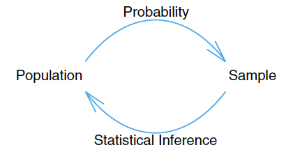

```{r setup, include=FALSE, out.width = "20%"}
knitr::opts_chunk$set(echo = TRUE)
```


### References
1. __Probability & Statistics for Engineers & Scientist__, 9th Edition, Ronald E. Walpole,
Raymond H. Myers,
Sharon L. Myers,
Keying Ye, Prentice Hall

## Objectives:

- Understand the difference between **Population** and **Sample**

- Know how to compute **Sample Mean** , **Sample Median**, and **Sample Variance**; How to interpret these measures

- Know how to create a **histogram** and **boxplot** in R; Understand the interpretation of these two plots

<br>

## Introduction to Statistics

- What is statistics?

    Statistics is the study of the collection, organization, analysis, and interpretation of data. 

- Basics of statistics:

    + Population: the entire group of individuals that we want information about. 
     
    + Sample: a part of the population that we actually examine in order to gather information about the whole population.
      
 **Example**:
 
  Population: Illinois Tech students  Sample: Students in our class

- Types of statistics:
    + Descriptive statistics: utilizes numerical and graphical methods to
	look for patterns in a data set, to summarize the information
	revealed in a data set, and to present the information in a
	convenient form.
	
    + Inferential statistics: use a fact about a sample to estimate the truth about the whole population.

```{r, out.width = "40%",out.height = "35%", echo = FALSE}

```

<br> 

### Descriptive Statistics

General two types of data:

- Qualitative data: observations that cannot be measured on a numerical scale. They can only be classified into one of a group of categories.

	Example: species of fish, eye color, marital status etc.
	
- Quantitative data: measurements that are recorded on a naturally occurring numerical scale.

	Example: height of person, score of test, etc.

#### Numerical Methods
Consider a quantitative dataset with $n$ observations, denoted as $\{x_1,\cdots,x_n\}$.

- Location Measures

  - Sample Mean: arithmetic average, denoted by $\bar{x}$

	$$\bar{x} = \frac{x_1+\cdots+x_n}{n} = \frac{1}{n}\sum\limits_{i=1}^n x_i=\frac{1}{n}\sum x_i$$

  The corresponding population parameter is population mean, denoted by $\mu$.

  - Sample median: middle number when the observations are arranged in ascending order, noted by $\tilde{x}$


   $$\tilde{x} = \begin{cases} x_{(n+1)/2}, & \text{ if } n \text{ is odd,} \\
     	\frac{1}{2}(x_{n/2} + x_{n/2+1}), & \text{ if } n \text{ is even.} \end{cases}
     	$$

**Note**: Median is less sensitive than mean to extremely large or small observations, which is good.

For example, a dataset $\{-3,0,4\}$, the **sample mean** is $1/3$ and the sample median is $0$. 

If the observation 4 is changed to 18, then the **sample mean** becomes $5$, while the sample median stays unchanged as $0$.

- Variability Measures

  + Sample range: measure of variability, $x_{\max} -x_{\min}$
  
  + Sample variance: measure of variability, spread out, denoted by $s^2$

$$ s^2 = \frac{(x_1-\bar{x})^2+\cdots+(x_n-\bar{x})^2}{n-1} = \frac{\sum\limits_{i=1}^n (x_i-\bar{x})^2}{n-1} $$

	The corresponding population parameter is population variance, denoted as $\sigma^2$.
	
  + Sample standard deviation:
	$s = \sqrt{s^2}$, common way for measuring how far observations are away from the mean.

	The corresponding population parameter is the population standard deviation, denoted as $\sigma$.

**Example 1**. Consider a tiny data set with three observations 5, 0, and 1. Find the sample mean, sample median, sample variance, and sample standard deviation.

$\bar{x} = (0+1+5)/3 = 2$, $\tilde{x} = 1$, 

$$s^2 = \frac{1}{3-1}\left[(0-2)^2+(1-2)^2
+(5-2)^2\right] = \frac{4+1+9}{3-1} = 7,\qquad s = \sqrt{7}.$$


### In-class exercise: Sample Mean, Median, and Variance

Consider a tiny data set with four observations 4, 2, -1 and 5. Find the sample mean, sample median, sample variance, and sample standard deviation.


**Question** How to use R find the sample mean, sample median, and sample variance?

Let's check a very small dataset `iris`, which comes with the default installation of R.  To check the sample mean and sample median of the data, just type `summary(iris)`.

```{r summary}
# Generate mean, median, percentile for numeric attributes and frequency for categorical attributes
summary(iris)
```

Use `var` to find the variance of one attribute `Petal.Width`.

```{r variance}
# Generate variance for numeric attributes
var(iris$Petal.Width)
```

### In-class exercise: Variance

1. Open **RStudio** on your machine
2. File > New File > R Markdown ...
3. Modify `summary(cars)` in the first code block to find the variance of `Sepal.Length`
4. Click `Knit HTML` to produce an HTML file.
5. Save your Rmd file as `InClassEx2.Rmd`

#### Graphical Methods
- Frequency table:
	
Example 2. 
The following is the life of 20 similar car batteries recorded to the nearest tenth of a year. The batteries are guaranteed to last $3$ years.

\begin{align*}
& 2.2,\ 4.1,\ 3.4,\ 4.4,\ 3.2,\ 3.7,\ 2.9,\ 2.6,\ 3.4,\ 1.6,\\
& 3.1, 3.3, 3.8, 3.1, 4.7, 3.7, 2.7, 4.3, 3.4, 3.6.
\end{align*}

Next, we want to create a frequency table for the above data.

\begin{array}{ccc}
\text{Interval} & \text{ Frequency}  & \text{Relative Frequency} \\
[1.5,2.0)& 1 & 0.05 \\
[2.0, 2.5) & 1 & 0.05 \\
[2.5, 3.0) & 3 & 0.15\\
[3.0,3.5)&  7 &  0.35 \\
[3.5,4.0) & 4 & 0.2\\
[4.0,4.5) & 3 & 0.15\\
[4.5,5.0] & 1 & 0.05
\end{array}

#### Histogram

 Graphically displays the contents in the frequency table

 - The class intervals in the frequency table form the scale of the horizontal axis.

- A vertical bar is placed over each class interval, with height equal to either the class frequency or class relative frequency.

- Used to plot the density of the data

How to plot histogram in R? Use the function `hist`.

#### Histogram of Car Batteries

```{r hist, echo = TRUE}
carBatteries <- c(2.2,4.1,3.4,4.5,3.2,3.7,2.9,2.6,3.4,1.6, 
                  3.1, 3.3, 3.8, 3.1, 4.7, 3.7, 2.7, 4.3, 3.4, 3.6)
hist(carBatteries, breaks = seq(1.5,5.0,l=8),col = "blue", 
     main = "Histogram of Car Batteries",xlab="Battery Life (years)")
```

#### Another Histogram of Car Batteries

What's the difference?

```{r histRelative, echo = TRUE}
hist(carBatteries, breaks = seq(1.5,5.0,l=8),col = "blue",  freq =FALSE,
     main = "Histogram of Car Batteries",xlab="Battery Life (years)")
```


#### In-class exercise: Histogram

1. Keep working on your Rmd file `InClassEx2.Rmd`
2. Use the `hist` function to create a histogram of `Petal.Length`.

#### Boxplot

Graphically depicting groups of numerical data through their quantiles.

- The line inside the box: median (50th percentile).

- The bottom edge of the box : first quantile (Q1/25th percentile)
  
- The top edge of the box: third quantile (Q3/75th percentile)
  
- Interquartile range (IQR): 25th to the 75th percentile.

- Bottom whisker (lower bar): from Q1 down to the minimum value within $1.5 \times$ IQR (interquartile range).

- Top whisker (upper bar): from Q3 up to the maximum value within $1.5 \times$ IQR.

#### Boxplot of Car Batteries

```{r boxplot,  echo = TRUE}
summary(carBatteries)
boxplot(carBatteries)
```

Use the `boxplot` function to create a boxplot of Petal Width.

```{r, out.width = "60%",out.height = "25%"}
boxplot(iris$Petal.Width, horizontal = TRUE)
```

`par(mfrow = c(1, 2))` creates a grid of size 1x2 for plots; it divides the plot area into a grid so you see several plots on the same page as opposed to separately. Try changing the 1 and the 2 to something else!

``` {r, out.width = "60%",out.height = "75%"}
par(mfrow = c(1, 2))
boxplot(iris$Sepal.Length)
boxplot(iris$Sepal.Width)
abline(h = min(iris$Sepal.Width), col = "Blue")
abline(h = max(iris$Sepal.Width), col = "Yellow")
abline(h = median(iris$Sepal.Width), col = "Green")
abline(h = quantile(iris$Sepal.Width, c(0.25, 0.75)), col = "Red")
```


#### In-class exercise: Boxplot

1. Keep working on your Rmd file `InClassEx2.Rmd`

2. Use the `boxplot` function to create a boxplot of `Petal.Length` 

3. Type your conclusion of outliers of `Petal.Length` in your Rmd file

4. Use `par(mfrow = c(1, 2))` to combine the boxplot of `Petal.Length` and `Petal.Width` 


#### In-class exercise: A Comprehensive Exercise

1. Add the following code block to `InClassEx2.Rmd` 

```{r}
carBatteries<-c(
  2.2,4.1,3.5, 4.5, 3.2, 3.7, 3.0, 2.6, 3.4, 1.6, 3.1, 3.3, 3.8, 3.1, 4.7, 3.7, 2.5, 
  4.3, 3.4, 3.6, 2.9, 3.3, 3.9, 3.1, 3.3, 3.1, 3.7, 4.4, 3.2, 4.1, 1.9, 3.4, 4.7, 
  3.8, 3.2, 2.6, 3.9, 3.0, 4.2, 3.5
)
```

2. Find the `mean`, `variance`, `std` of `carBatteries`

3. Find the `mean`, `variance`, `std` of `carBatteries` when `carBatteries > 3`

3. Create a `histogram` of `carBatteries`

4. Create a `boxplot` of `carBatteries`


