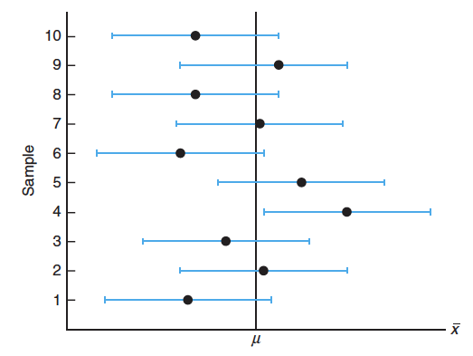
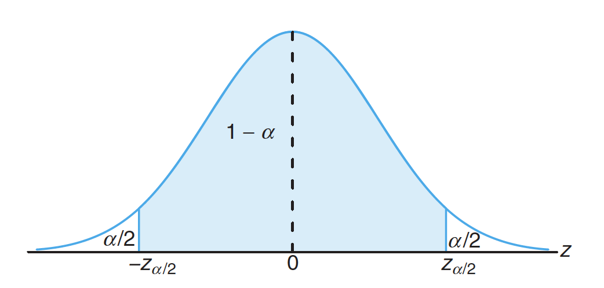
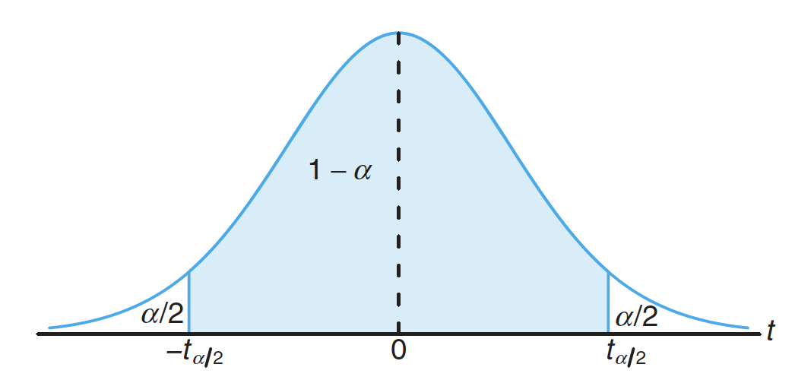

   
```{r setup, include=FALSE}
knitr::opts_chunk$set(
  echo = TRUE,comment = '', fig.align = 'center'  , out.width="50%"
)
knitr::include_graphics
```

## References
1. __Probability & Statistics for Engineers & Scientist__, 9th Edition, Ronald E. Walpole,
Raymond H. Myers,
Sharon L. Myers,
Keying Ye, Prentice Hall


## Objectives

- Understand the reasons why we use interval estimate instead of point estimate

- Know how to **use R** to construct a confidence interval(CI) on **Mean** and **Difference of Two Means** 

- Understand when to use `t.test` to construct CI for **Mean** and **Difference of Two Means**


### Review Central Limit Theorem (CLT)

Let $\bar{X}$ be the mean of a random sample of size $n$ taken from a population with mean $\mu$ and finite variance $\sigma^2$, then the limiting form of the distribution of 
$$Z = \frac{\bar{X} -\mu}{\sigma/\sqrt{n}},$$
as $n\rightarrow \infty$, is the standard normal distribution, i.e., $Z \sim \mathcal{N}(0,1)$.

This tells us sample mean $\bar{X}$ should be a **good estimate** of population mean $\mu$, when sample size large enough. However, it is not good enough to estimate $\mu$ just by one point $\bar{X}$. We want to use an interval to estimate $\mu$.


## Interval Estimate

An **interval estimate** of a population parameter $\theta$ is an interval of the form
$\theta_{L} < \theta < \theta_{U}.$


For example, a random sample of SAT verbal scores for students in the entering freshman class
might produce an interval from 530 to 550, within which we expect to find the
true average of all SAT verbal scores for the freshman class.

**Question**: How to choose $\theta_{L}$ and $\theta_{U}$?

If we find $\theta_{L}$ and $\theta_{U}$ such that
	$$ P(\theta_{L} < \theta < \theta_{U}) = 1- \alpha,$$
	where $0 < \alpha < 1,$ the interval $(\theta_{L} , \theta_{U})$ is called a $100(1-\alpha)\%$ 
 **confidence interval**, the fraction $1-\alpha$ is called the  **confidence coefficient**, 
and $\theta_{L}$ and $\theta_{U}$ are called the *lower and upper confidence limits*.

\begin{remark}
The wider the confidence interval is, the
more confident we can be that the interval contains the unknown parameter.
\end{remark}


### Confidence Interval on $\mu$ when $\sigma$ known

As we know
$$ Z = \frac{\bar{X}-\mu}{\sigma/\sqrt{n}} \sim \mathcal{N}(0,1), $$
suppose $z_{\alpha/2}$ denote the value such that 
$$P(-z_{\alpha/2} < Z <z_{\alpha/2}) = 1- \alpha$$
as the following figure, where $\alpha =0.05$.

```{r,echo = FALSE}
# Parameters
x <- seq(-4, 4, length = 1000)
y <- dnorm(x)

# Critical values for 95% confidence level
alpha <- 0.05
crit_left  <- qnorm(alpha/2)      # left critical value
crit_right <- qnorm(1 - alpha/2)  # right critical value

# Plot standard normal curve
plot(x, y, type = "l", lwd = 2, col = "blue",
     xlab = "Z", ylab = "Density",
     main = "Critical Values for α = 0.05 (Two-tailed Test)")

# Shade rejection regions
polygon(c(min(x), x[x<=crit_left], crit_left),
        c(0, y[x<=crit_left], 0), col = "red", border = NA, density = 30)
polygon(c(crit_right, x[x>=crit_right], max(x)),
        c(0, y[x>=crit_right], 0), col = "red", border = NA, density = 30)

# Add reference lines
abline(v = crit_left,  col = "red", lty = 2, lwd = 2)
abline(v = crit_right, col = "red", lty = 2, lwd = 2)

# Annotate critical values
text(crit_left, 0.02, round(crit_left, 2), pos = 2, col = "red")
text(crit_right, 0.02, round(crit_right, 2), pos = 4, col = "red")
```


We can have
$$P(-z_{\alpha/2} < \frac{\bar{X}-\mu}{\sigma/\sqrt{n}}  <z_{\alpha/2}) = P(-\frac{\sigma}{\sqrt{n} }z_{\alpha/2} < \bar{X}-\mu< \frac{\sigma}{\sqrt{n} }z_{\alpha/2}) 
= P(\bar{X} -\frac{\sigma}{\sqrt{n} }z_{\alpha/2} < \mu< \bar{X} +\frac{\sigma}{\sqrt{n} }z_{\alpha/2})
=1- \alpha.$$
That is 
the interval $(\bar{X} -\frac{\sigma}{\sqrt{n} }z_{\alpha/2}, \bar{X} +\frac{\sigma}{\sqrt{n} }z_{\alpha/2})$ is an **interval estimate** of $\mu$ with confidence $100(1-\alpha)\%.$ Actually the confidence is the probability.

Suppose confidence is 95%, we know $\alpha = 1-95\%  = 0.05$, that is $\alpha/2 = 0.025$. How to find $z_{\alpha/2}$?

```{r}
alpha <- 0.05
z_0.025 <- qnorm(1-alpha/2) # why?
z_0.025
p<-pnorm(z_0.025) - pnorm(-z_0.025)
p
```

Different samples will yield different values of $\bar{x}$ and therefore produce different
interval estimates of the parameter $\mu$, as shown below.

```{r,echo = FALSE}

```


Can you construct a 99% confidence interval for $\mu$?


**Example 1** The average zinc concentration recovered from a sample of measurements taken
in 36 different locations in a river is found to be 2.6 grams per milliliter. Find
the 95\% and 99\% confidence intervals for the mean zinc concentration in the river.
Assume that the population standard deviation is 0.3 gram per milliliter.


```{r}
n <- 36 #sample size
xbar <- 2.6  #sample mean
sigma <- 0.3  #population sd
alpha1 <- 0.05
#Left endpoint for confidence 95%
lend1 <- xbar - sigma/sqrt(n)*qnorm(1-alpha1/2)
#Right endpoint for confidence 95%
rend1 <- xbar + sigma/sqrt(n)*qnorm(1-alpha1/2)
alpha2 <- 0.01
#Left endpoint for confidence 99%
lend2 <- xbar - sigma/sqrt(n)*qnorm(1-alpha2/2)
#Right endpoint for confidence 99%
rend2 <- xbar + sigma/sqrt(n)*qnorm(1-alpha2/2)
```

The $95\%$ confidence interval is (`r lend1`, `r rend1`). The $99\%$ confidence interval is (`r lend2`, `r rend2`). 

**Question**: Suppose some evidence shows the mean zinc concentration in the river ($\mu$) should be $2.5$. Does that make sense?

As we know $\bar{X} \sim \mathcal{N}(\mu, \sigma^2/n),$ let's find the probability $\bar{X} \ge 2.6$.

```{r}
p1<-1- pnorm(xbar,mean = 2.5, sd = sigma/sqrt(n))
p1
```

Actually, this is one way to do the hypothesis testing. We will talk about that later.

#### In-class Exercise: CI on mean

A manufacturer of sports equipment has developed a new synthetic fishing line with a standard
deviation of 0.5 kilogram. If a random sample of 50 lines is tested and found
to have a mean breaking strength of 7.8 kilograms, can you construct a $99\%$ confidence interval.

### If we don't know $\sigma$

If the population follows **normal distribution** or *approximately* **normal distribution**, we can use **$t-$distribution**.

If we have a random sample from a **normal distribution**, then the random variable 
$$T = \frac{\bar{X}-\mu}{S/\sqrt{n}}$$
has a Student $t$-distribution with $n-1$ degrees of freedom. Here $S$ is the sample standard deviation.

Let $\alpha = 0.05, n-1 =10$.

```{r,echo = FALSE}
# Parameters
alpha <- 0.05
df <- 10

# Critical t value for two-tailed test
t_crit <- qt(1 - alpha/2, df)

# Range for x-axis
x <- seq(-4, 4, length = 500)
y <- dt(x, df)

# Plot t-distribution
plot(x, y, type = "l", lwd = 2, col = "blue",
     main = expression(paste("t-Distribution with df = 10, ", alpha, " = 0.05")),
     ylab = "Density", xlab = "t value")

# Shade critical regions
x_crit_left <- seq(-4, -t_crit, length = 100)
x_crit_right <- seq(t_crit, 4, length = 100)

polygon(c(x_crit_left, rev(x_crit_left)), 
        c(dt(x_crit_left, df), rep(0, length(x_crit_left))), 
        col = "red", border = NA)

polygon(c(x_crit_right, rev(x_crit_right)), 
        c(dt(x_crit_right, df), rep(0, length(x_crit_right))), 
        col = "red", border = NA)

# Add vertical lines at critical values
abline(v = c(-t_crit, t_crit), col = "darkred", lwd = 2, lty = 2)

# Add text annotations
text(-t_crit, 0.02, sprintf("t = %.3f", -t_crit), pos = 2, col = "darkred")
text(t_crit, 0.02, sprintf("t = %.3f", t_crit), pos = 4, col = "darkred")

# Add legend
legend("topright", legend = c("t density", "Critical regions (α = 0.05)"),
       col = c("blue", "red"), lwd = 2, bty = "n")
```

### Confidence Interval on $\mu$ when $\sigma^2$ unknown

If $\bar{x}$ and $s$ are the mean and the standard deviation of a random sample of size $n$ from a \textbf{normal} distribution with unknown variance $\sigma^2$, 
a $100(1-\alpha)\%$ confidence interval for $\mu$ is given by 
$$\bar{x} - t_{n-1,\alpha/2}\frac{S}{\sqrt{n}} < \mu < \bar{x} + t_{n-1,\alpha/2}\frac{S}{\sqrt{n}},$$
where $t_{n-1,\alpha/2}$ is the $t-$value with $v =n-1$ degrees of freedom, leaving an area of $\alpha/2$ to the right.

**Example 2** 
The contents of seven similar containers of sulfuric acid are 9.8, 10.2, 10.4, 9.8,
10.0, 10.2, and 9.6 liters. Find a 95% confidence interval for the mean contents of
all such containers, assuming an *approximately normal distribution*.

```{r}
sulfruicAcid<-c(9.8,10.2,10.4,9.8,10.0,10.2,9.6)
xbar <- mean(sulfruicAcid)
s <-sd(sulfruicAcid)
n <- 7
alpha <- 0.05
t6_0.025<- qt(1-alpha/2,n-1)
lowerBound <- xbar-t6_0.025*s/sqrt(n)
lowerBound
upperBound <- xbar+t6_0.025*s/sqrt(n)
upperBound
```

A different way to get confidence interval

```{r}
t.test(sulfruicAcid, conf.level = .95)
```


#### In-class Exercise: CI on $\mu$ with unknown variance

1. Regular consumption of presweetened cereals contributes to tooth decay, heart disease,
and other degenerative diseases, according to studies conducted by Dr. W. H. Bowen
of the National Institute of Health and Dr. J. Yudben, Professor of Nutrition and
Dietetics at the University of London. In a random sample consisting of 20 similar
single servings of Alpha-Bits, the average sugar content was 11.3 grams with a standard
deviation of 2.45 grams. Assuming that the sugar contents are normally distributed,
construct a 95% confidence interval for the mean sugar content for single servings of
Alpha-Bits.

2. Please construct a 95% confidence interval for the mean of `Sepal.Length` in the `iris` data set, assume the normal distribution.


### Check Point Questions:

### Quick Check: Confidence Intervals for a Population Mean

This short practice is not graded. Select an answer to receive immediate
feedback.

<style>
.quick-check {
  border: 1px solid #d9e2ec;
  border-radius: 7px;
  padding: 0.7rem 0.9rem;
  margin: 0.8rem 0;
  background: #f8fafc;
}
.quick-check p {
  margin: 0 0 0.4rem;
}
.quick-check label {
  display: block;
  margin: 0.18rem 0;
  line-height: 1.4;
  cursor: pointer;
}
.quiz-feedback {
  min-height: 1.2rem;
  margin-top: 0.4rem;
  font-weight: 600;
}
</style>

<div class="quick-check">
<p><strong>1. To find a confidence interval for a population mean when the
population variance is known, which of the following should we use?</strong></p>

<p>Suppose $X_1,\ldots,X_{100}$ is a random sample of size 100 from an
unknown distribution.</p>

<label>
<input type="radio" name="ci-known" value="correct">
A. The normal distribution (with the Z statistic)
</label>

<label>
<input type="radio" name="ci-known" value="incorrect">
B. The normal distribution (with the Z statistic), but only if $X$
comes from a normal distribution
</label>

<label>
<input type="radio" name="ci-known" value="incorrect">
C. The t-distribution (with the T statistic)
</label>

<label>
<input type="radio" name="ci-known" value="incorrect">
D. The t-distribution (with the T statistic), but only if $X$
comes from a normal distribution
</label>

<div id="feedback-ci-known" class="quiz-feedback"></div>
</div>

<div class="quick-check">
<p><strong>2. To find a confidence interval for a population mean when the
population variance is unknown, which of the following should we use?</strong></p>

<p>Suppose $X_1,\ldots,X_{20}$ is a random sample of size 20 from an
unknown distribution.</p>

<label>
<input type="radio" name="ci-unknown" value="incorrect">
A. The normal distribution (with the Z statistic)
</label>

<label>
<input type="radio" name="ci-unknown" value="incorrect">
B. The normal distribution (with the Z statistic), but only if $X$
comes from a normal distribution
</label>

<label>
<input type="radio" name="ci-unknown" value="incorrect">
C. The t-distribution (with the T statistic)
</label>

<label>
<input type="radio" name="ci-unknown" value="correct">
D. The t-distribution (with the T statistic), but only if $X$
comes from a normal distribution
</label>

<div id="feedback-ci-unknown" class="quiz-feedback"></div>
</div>

<script>
(function () {
  function setUpQuestion(name, feedbackId, explanation) {
    const choices = document.querySelectorAll(
      'input[name="' + name + '"]'
    );
    const feedback = document.getElementById(feedbackId);

    choices.forEach(function (choice) {
      choice.addEventListener("change", function () {
        if (this.value === "correct") {
          feedback.innerHTML =
            '<span style="color:#16803a;">Correct!</span> ' + explanation;
        } else {
          feedback.innerHTML =
            '<span style="color:#c53030;">Not quite.</span> Try again.';
        }
      });
    });
  }

  setUpQuestion(
    "ci-known",
    "feedback-ci-known",
    "Because the population variance is known, we use the Z statistic. " +
    "The large sample size allows us to use the normal approximation."
  );

  setUpQuestion(
    "ci-unknown",
    "feedback-ci-unknown",
    "When the population variance is unknown, the T statistic has an exact " +
    "t-distribution only if the population is normally distributed. Since " +
    "the sample size is small, normality of the population is required."
  );
})();
</script>


### Quick Check: Matching Statistical Terms

Match each description with the appropriate term by dragging the terms into
the boxes.

<div class="term-bank">
  <div class="term" draggable="true" data-term="Population">Population</div>
  <div class="term" draggable="true" data-term="Sample">Sample</div>
  <div class="term" draggable="true" data-term="Descriptive statistic">
    Descriptive statistic
  </div>
  <div class="term" draggable="true" data-term="Parameter">Parameter</div>
  <div class="term" draggable="true" data-term="Inferential statistic">
    Inferential statistic
  </div>
</div>

<div class="match-row">
  <div><strong>a.</strong> All home compost bins in Galicia, Spain</div>
  <div class="drop-zone" data-answer="Population"></div>
</div>

<div class="match-row">
  <div><strong>b.</strong> The 87 randomly selected home compost bins</div>
  <div class="drop-zone" data-answer="Sample"></div>
</div>
<div class="match-row">
  <div><strong>c.</strong> The sample mean moisture content,
    $\bar{x}=68.1\%$
  </div>
  <div class="drop-zone" data-answer="Descriptive statistic"></div>
</div>

<div class="match-row">
  <div> <strong>d.</strong> The mean moisture content for all compost similarly
    produced by home compost bins in Galicia, Spain, $\mu$
  </div>
  <div class="drop-zone" data-answer="Parameter"></div>
</div>

<div class="match-row">
  <div><strong>e.</strong> The 95% confidence interval for the population mean
    moisture content, $(66.1\%,70.1\%)$
  </div>
  <div class="drop-zone" data-answer="Inferential statistic"></div>
</div>

<button type="button" id="check-match">Check Answers</button>
<button type="button" id="reset-match">Reset</button>

<p id="match-result"></p>

<style>
.term-bank {
  display: flex;
  flex-wrap: wrap;
  gap: 0.5rem;
  min-height: 45px;
  padding: 0.7rem;
  margin: 0.8rem 0;
  border: 2px dashed #94a3b8;
  border-radius: 7px;
  background: #f8fafc;
}

.term {
  padding: 0.4rem 0.7rem;
  border: 1px solid #64748b;
  border-radius: 5px;
  background: white;
  cursor: grab;
}

.match-row {
  display: grid;
  grid-template-columns: 2fr 1fr;
  gap: 1rem;
  align-items: center;
  margin: 0.7rem 0;
}

.drop-zone {
  min-height: 42px;
  padding: 0.3rem;
  border: 2px dashed #94a3b8;
  border-radius: 6px;
  background: #f8fafc;
}

.drop-zone .term {
  display: inline-block;
}

#check-match,
#reset-match {
  margin: 0.8rem 0.3rem 0 0;
  padding: 0.4rem 0.8rem;
}

#match-result {
  min-height: 1.2rem;
  font-weight: 600;
}
</style>

<script>
(function () {
  const terms = document.querySelectorAll(".term");
  const zones = document.querySelectorAll(".drop-zone");
  const bank = document.querySelector(".term-bank");
  const result = document.getElementById("match-result");
  let draggedTerm = null;

  terms.forEach(function (term) {
    term.addEventListener("dragstart", function () {
      draggedTerm = term;
    });
  });

  zones.forEach(function (zone) {
    zone.addEventListener("dragover", function (event) {
      event.preventDefault();
    });

    zone.addEventListener("drop", function (event) {
      event.preventDefault();

      if (zone.children.length > 0) {
        bank.appendChild(zone.firstElementChild);
      }

      zone.appendChild(draggedTerm);
    });
  });

  bank.addEventListener("dragover", function (event) {
    event.preventDefault();
  });

  bank.addEventListener("drop", function (event) {
    event.preventDefault();
    bank.appendChild(draggedTerm);
  });

  document.getElementById("check-match").onclick = function () {
    let correct = 0;

    zones.forEach(function (zone) {
      if (
        zone.firstElementChild &&
        zone.firstElementChild.dataset.term === zone.dataset.answer
      ) {
        zone.style.borderColor = "#16803a";
        zone.style.background = "#ecfdf3";
        correct++;
      } else {
        zone.style.borderColor = "#c53030";
        zone.style.background = "#fff5f5";
      }
    });

    result.textContent = correct + " out of 5 correct.";
    result.style.color = correct === 5 ? "#16803a" : "#c53030";
  };

  document.getElementById("reset-match").onclick = function () {
    terms.forEach(function (term) {
      bank.appendChild(term);
    });

    zones.forEach(function (zone) {
      zone.style.borderColor = "#94a3b8";
      zone.style.background = "#f8fafc";
    });

    result.textContent = "";
  };
})();
</script>

## Estimating the Difference between Two Means

Next, we want to investigate two populations with means $\mu_1$ and $\mu_2$ and variances $\sigma_1^2$ and $\sigma_2^2$, respectively. Thus we can have a point estimator of the difference between $\mu_1$ and $\mu_2$ is given by the statistic $\bar{x}_1-\bar{x}_2$.

### Confidence Interval on $\mu_1-\mu_2$ when $\sigma_1^2$ and $\sigma_2^2$ known

If $\bar{x}_1$ and $\bar{x}_2$ are the means of independent  random samples of sizes $n_1$ and $n_2$ from populations with known variances $\sigma_1^2$ and $\sigma_2^2$, respectively,  
a $100(1-\alpha)\%$ confidence interval for $\mu_1-\mu_2$ is given by 
$$ (\bar{x}_1-\bar{x}_2) - z_{\alpha/2}\sqrt{\frac{\sigma^2_1}{n_1} +\frac{\sigma^2_2}{n_2}}< \mu_1-\mu_2 < (\bar{x}_1-\bar{x}_2) + z_{\alpha/2}\sqrt{\frac{\sigma^2_1}{n_1} +\frac{\sigma^2_2}{n_2}},$$
where $z_{\alpha/2}$ is the $z-$value leaving an area of $\alpha/2$ to the right.

**Example 3** A study was conducted in which two types of engines, $A$ and $B,$ were compared.
Gas mileage, in miles per gallon, was measured. Fifty experiments were conducted
using engine type $A$ and 75 experiments were done with engine type $B.$ The
gasoline used and other conditions were held constant. The average gas mileage
was 36 miles per gallon for engine $A$ and 42 miles per gallon for engine $B$. Find a
96\% confidence interval on $\mu_B - \mu_A,$ where $\mu_A$ and $\mu_B$  are population mean gas
mileages for engines $A$ and $B,$ respectively. Assume that the population standard
deviations are 6 and 8 for engines $A$ and $B,$ respectively.

```{r}
alpha <- 0.04
n1 <- 50
x1 <- 36
n2 <- 75
x2 <- 42
sigma1 <- 6
sigma2 <- 8
standerror <- sqrt(sigma1^2 /n1 + sigma2^2/n2)
lowerBound <- x2-x1 - qnorm(1-alpha/2)*standerror
lowerBound
upperBound <- x2-x1 + qnorm(1-alpha/2)*standerror
upperBound
```

#### In-class Exercise: CI on $\mu_1-\mu_2$ with known $\sigma_1$ and $\sigma_2$

1. Generate 50 normal random numbers with $\mu_1 = 3$ and $\sigma_1 = 3$ and get the sample mean $\bar{x}_1$.
Hint: `rnorm`

2. Generate 75 normal random numbers with $\mu_2 = 2$ and $\sigma_2 = 4$ and get the sample mean $\bar{x}_2$

3. Please construct a 95% confidence interval on $\mu_1-\mu_2$.

**Question**: If we don't know the variances, what should we do?


### Confidence Interval on $\mu_1-\mu_2$ when $\sigma_1^2  = \sigma_2^2$ but Both Unknown

If $\bar{x}_1$ and $\bar{x}_2$ are the means of independent  random samples of sizes $n_1$ and $n_2$, respectively, from \textit{approximately normal populations} with \textbf{unknown but equal variances},  
a $100(1-\alpha)\%$ cofidence interval for $\mu_1-\mu_2$ is given by 
$$ (\bar{x}_1-\bar{x}_2) - t_{n_1+n_2-2,\alpha/2}s_p\sqrt{\frac{1}{n_1} +\frac{1}{n_2}}< \mu_1-\mu_2 < (\bar{x}_1-\bar{x}_2) + t_{n_1+n_2-2,\alpha/2}s_p\sqrt{\frac{1}{n_1} +\frac{1}{n_2}},$$
where $$s_p^2 = \frac{(n_1-1)S_1^2 +(n_2-1)S_2^2  }{n_1+n_2-2}$$ is the pooled estimater of the population standard deviation and $t_{n_1+n_2-2,\alpha/2}$ 
is the $t-$value with $v =n_1+n_2-2$ degrees of freedom, leaving an area of $\alpha/2$ to the right.

**Example 4** In a study conducted at Virginia Tech on the
development of ectomycorrhizal, a symbiotic relationship
between the roots of trees and a fungus, in which
minerals are transferred from the fungus to the trees
and sugars from the trees to the fungus, 20 northern
red oak seedlings exposed to the fungus Pisolithus tinctorus
were grown in a greenhouse. All seedlings were
planted in the same type of soil and received the same amount of sunshine and water. Half received no nitrogen
at planting time, to serve as a control, and the
other half received 368 ppm of nitrogen in the form
NaNO3. The stem weights, in grams, at the end of 140
days were recorded as follows:

No Nitrogen: 
0.32 0.53 0.28 0.37 0.47 0.43 0.36 0.42 0.38 0.43

Nitrogen: 
0.26 0.43 0.47 0.49 0.52 0.75 0.79 0.86 0.62 0.46

Construct a 95% confidence interval for the difference in the mean stem weight between seedlings that receive no nitrogen and those that receive 368 ppm of nitrogen. Assume the populations to be normally distributed with equal variances. 

```{r}
noNitro<- c(0.32,0.53 ,0.28, 0.37, 0.47, 0.43, 0.36, 0.42,0.38,0.43)
x1bar <- mean(noNitro)
s1 <- sd(noNitro)
n1 <- 10
Nitro<- c(0.26,0.43,0.47,0.49,0.52,0.75,0.79,0.86, 0.62,0.46)
x2bar <- mean(Nitro)
s2<- sd(Nitro)
n2<- 10
sp<- sqrt(((n1-1)*s1^2 + (n2-1)*s2^2)/(n1+n2-2))
alpha <- 0.05
loBound<- x1bar-x2bar - qt(1-alpha/2,n1+n2-2)*sp*sqrt(1/n1+1/n2)
loBound
upBound<-x1bar-x2bar + qt(1-alpha/2,n1+n2-2)*sp*sqrt(1/n1+1/n2)
upBound
```

Can we use `t.test`? *Yes!*

We can use two sample t-test. Don't forget to add the condition `var.equal = TURE`. 
```{r}
t.test(noNitro,Nitro, var.equal = TRUE, conf.level = .95)
# Construct a data frame with two columns
stemWeight<-c(0.32,0.53 ,0.28, 0.37, 0.47, 0.43, 0.36, 0.42,0.38,0.43,0.26,0.43,0.47,0.49,0.52,0.75,0.79,0.86, 0.62,0.46)
group<-c(rep(0,10),rep(1,10))
stemData<-data.frame(stemWeight,group)
stemData
t.test(stemWeight~group, data = stemData,var.equal = TRUE, conf.level = .95)
```


#### Note: If the population variances are unknow but different, you still can use `t.test` to construct the confidence interval on $\mu_1-\mu_2$ with `var.equal = FALSE`. In this case, the degree of freedoms is no longer an integer.

```{r}
t.test(noNitro,Nitro, var.equal = FALSE, conf.level = .95)
# Or you can use
t.test(stemWeight~group, data = stemData,var.equal = FALSE, conf.level = .95)
```


#### In-class Exercise A: CI on $\mu_1-\mu_2$ with unknown $\sigma_1 = \sigma_2$

Let's play with `iris` data set. We want to compare the population mean of `Sepal.Length` between `Setosa` and `Virginica`. Suppose we know these two species come from the normal distribution with the same variance. Can you construct a confidence interval on $\mu_{virginica}-\mu_{setosa}$ with 95% confidence?

#### In-class Exercise B: CI on $\mu_1-\mu_2$ with unknown $\sigma_1 \ne \sigma_2$

Let's play with `iris` data set. We want to compare the population mean of `Sepal.Length` between `Setosa` and `Virginica`. Suppose we know these two species come from the normal distribution with different variances. Can you construct a confidence interval on $\mu_{virginica}-\mu_{setosa}$ with 95% confidence?


**Question**: How to choose `var.equal = TRUE` or `var.equal = FALSE`?

We can do a hypothesis testing for variance. We will talk about it in the future lectures.


## Conclusion:

### Confidence Interval on $\mu$
- **When $\sigma^2$ Known**

Suppose $z_{\alpha/2}$ denote the value such that 
$$P(-z_{\alpha/2} < \frac{\bar{X}-\mu}{\sigma/\sqrt{n}} <z_{\alpha/2}) = 1- \alpha.$$

```{r,echo = FALSE,out.width = "50%",out.height = "50%",fig.align='center'}

```

If $\bar{x}$ is the mean of a random sample of size $n$ from a population with **known** variance $\sigma^2$, 
a $100(1-\alpha)\%$ confidence interval for $\mu$ is given by
$$ \bar{x} - z_{\alpha/2} \frac{\sigma}{\sqrt{n}} < \mu < \bar{x} + z_{\alpha/2} \frac{\sigma}{\sqrt{n}},$$
where $z_{\alpha/2}$ is the z-value leaving an area of 
$\alpha/2$ to the right, which can be founded by `qnorm(1-alpha/2)`.

- **When $\sigma^2$ Unknown**

If the population follows **normal distribution** or *approximately* **normal distribution**, we can use $t-$distribution.
Suppose $t_{\alpha/2}$ denote the value such that 
$$P(-t_{\alpha/2} < \frac{\bar{X}-\mu}{s/\sqrt{n}} <t_{\alpha/2}) = 1- \alpha.$$

```{r,echo = FALSE,out.width = "50%",out.height = "50%",fig.align='center'}

```


If $\bar{x}$ and $s$ are the mean and the standard deviation of a random sample of size $n$ from a \textbf{normal} distribution with unknown variance $\sigma^2$, 
a $100(1-\alpha)\%$ confidence interval for $\mu$ is given by 
$$ \bar{x} - t_{\alpha/2}\frac{s}{\sqrt{n}} < \mu < \bar{x} + t_{\alpha/2}\frac{s}{\sqrt{n}},$$
where $t_{\alpha/2}$ is the $t-$value with $v =n-1$ degrees of freedom, leaving an area of $\alpha/2$ to the right, which can be founded by `qt(1-alpha/2,v)`.
You can also use `t.test` to find the confidence interval, if the data is given.

### Confidence Interval on $\mu_1-\mu_2$

- **When $\sigma_1^2$ and $\sigma_2^2$ known**

If $\bar{x}_1$ and $\bar{x}_2$ are the means of independent  random samples of sizes $n_1$ and $n_2$ from populations with known variances $\sigma_1^2$ and $\sigma_2^2$, respectively,  
a $100(1-\alpha)\%$ confidence interval for $\mu_1-\mu_2$ is given by 
$$ (\bar{x}_1-\bar{x}_2) - z_{\alpha/2}\sqrt{\frac{\sigma^2_1}{n_1} +\frac{\sigma^2_2}{n_2}}< \mu_1-\mu_2 < (\bar{x}_1-\bar{x}_2) + z_{\alpha/2}\sqrt{\frac{\sigma^2_1}{n_1} +\frac{\sigma^2_2}{n_2}},$$
where $z_{\alpha/2}$ is the $z-$value leaving an area of $\alpha/2$ to the right, which can be founded by `qnorm(1-alpha/2)`.

- **When $\sigma_1^2$ and $\sigma_2^2$ Unknown**

You can use `t.test` to find the confidence interval, if the data is given. Please choose the approporiate condition for `var.equal`.
