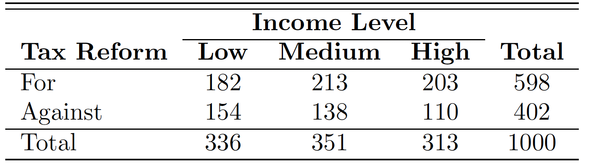
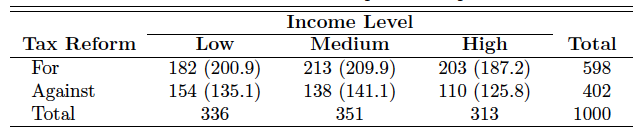

```{r setup, echo=FALSE}
knitr::opts_chunk$set(echo = TRUE,comment = '', fig.align = 'center'  , out.width="70%")
```

```{r packages, message = FALSE}
library(ggplot2)
library(MASS)
```


## Reference

1. Probability & Statistics for Engineers & Scientist, 9th Edition, Ronald E. Walpole, Raymond H. Myers, Sharon L. Myers, Keying Ye, Prentice Hall

2. Chi-squared Test of Independence, http://www.r-tutor.com/elementary-statistics/goodness-fit/chi-squared-test-independence

3. Understanding ANOVA in R, https://bookdown.org/steve_midway/DAR/understanding-anova-in-r.html

## Outline
- Association
  * Categorical and Continuous Variables
     - ANOVA Test
  * Categorical and Categorical Variables
    - Chi-squared Test
    - Cramer's V (phi) Coefficient


## Asscociation


### Association between One Numerical Variable and One Categorical Variable

We can use **ANOVA test** to check the association between one numerical variable and one categorical variable with `aov` function.
ANOVA(AOV) is short for ANalysis Of VAriance.

Let's play with `Boston` data set from `MASS` package. 

- medv: median value of owner-occupied homes in $1000s.

- chas: Charles River dummy variable (= 1 if tract bounds river; 0 otherwise).

```{r}
ggplot(data = Boston, aes(x = as.factor(chas), y = medv )) + geom_boxplot()
```


```{r}
aov1 <- aov(medv ~ chas, data = Boston)
summary(aov1)
```

**Interpretation**:

* The Df column displays the degrees of freedom for the independent variable (the number of levels in the variable minus 1), and the degrees of freedom for the residuals (the total number of observations minus one and minus the number of levels in the independent variables).

* The Sum Sq column displays the sum of squares (a.k.a. the total variation between the group means and the overall mean).

* The Mean Sq column is the mean of the sum of squares, calculated by dividing the sum of squares by the degrees of freedom for each parameter.

* The F-value column is the test statistic from the F test. This is the mean square of each independent variable divided by the mean square of the residuals. The larger the F value, the more likely it is that the variation caused by the independent variable is real and not due to chance.

* The Pr(>F) column is the p-value of the F-statistic. This shows how likely it is that the F-value calculated from the test would have occurred if the null hypothesis of no difference among group means were true.

Here, the p-value of the `chas` variable is very low (p < 0.001), so it appears that the type of `chas` used has a real impact on the
`medv`.


#### Revisit the EDA dataset `diamonds`

- price: price in US dollars ($\$326–\$18,823$)

- carat: weight of the diamond (0.2–5.01)

- cut: quality of the cut (Fair, Good, Very Good, Premium, Ideal)

- color: diamond color, from D (best) to J (worst)

- clarity: a measurement of how clear the diamond is (I1 (worst), SI2, SI1, VS2, VS1, VVS2, VVS1, IF (best))

- x:length in mm (0–10.74)

- y: width in mm (0–58.9)

- z: depth in mm (0–31.8)

- depth: total depth percentage $=  2 * z / (x + y) (43–79)$

- table: width of top of diamond relative to widest point (43–95)

Here we want to investigate the relationship between `cut` and `price`.

```{r boxplot, out.width = "50%",out.height = "50%"}
ggplot(data = diamonds, mapping = aes(x = cut, y = price)) +
  geom_boxplot()
```

What can you tell from the boxplot?

```{r}
aov2 <- aov(price ~ cut, data = diamonds)
summary(aov2)
```

Based on the anova test, as the p-value is very low (p < 0.001), so it appears that the type of `cut` used has a real impact on the
`price`, even though we cannot tell it from the visulization. 

#### In-Calss Exercise: ANOVA Test

* Please construct an ANOVA test for `Species` and `Petal.Length`. What is your conclusion?

* Please construct an ANOVA test for `salary` and `sex` in the `Salaries` data set. What is your conclusion? What about `salary` and `rank`? Note: `Salaries` is in the `carData` package.


### Associations between Categorical Variables

### Chi-squared  Test

We can use *Chi-squared Test*to determine *if a population has a specified theoretical distribution*. We can also  use `Chi-squared Test` to check the independence of two categorical features/attributes. 

- $H_0$: (**null hypothesis**) The two variables are independent.
- $H_1$: (**alternative hypothesis**) The two variables are dependent.

We need the **contingency table**. **Contingency table** is a table with observed frequencies. Let's see the following example.

**Example 1.**
Suppose that
we wish to determine whether the opinions of the voting residents of the state
of Illinois concerning a new tax reform are independent of their levels of income.
Members of a random sample of 1000 registered voters from the state of Illinois
are classified as to whether they are in a low, medium, or high income bracket and
whether or not they favor the tax reform.

 The following is $2 \times 3$ contingency table.

```{r,echo = FALSE}

```

Assuming the independence, the expected frequence is given by the following formula:
$$ \text{expected frequency} = \frac{(\text{column total})\times (\text{row total})}{\text{grand total}}$$

Thus, we have the following table. 

```{r,echo = FALSE}

```

Based on the table, we can also calculate the $\chi^2$ value. Here, we omit the process.

How to use `chisq.test`?

```{r} 
# Manually enter the data
taxreform <- rbind(c(182,213,203), c(154,138,110))
dimnames(taxreform) <- list(
  reform = c("For", "Against"), 
  IncomeLevel = c("Low","Medium", "High"))
# display the data
taxreform 
# chi-square test
chitest1 <- chisq.test(taxreform)
chitest1
```

Based on the result, the null hypothesis is rejected and we conclude that a voter’s opinion concerning the tax reform and his or her level of income are not independent.

Why degree freedom is 2? Actually
$$ v = (r-1)(c-1),$$
where $r$ is # of rows and $c$ is # of columns.


#### Revisit the EDA dataset `diamonds` again

Here we want to investigate the relationship between `cut` and `clarity`.

```{r}
# Create contingency table
cutclarity<-table(diamonds$cut,diamonds$clarity)

# Conduct Chi-squared Test
chisqtestResult1<- chisq.test(cutclarity)
chisqtestResult1
```

Since we get a p-value less than the significance level of 0.05, we should reject the null hypothesis and conclude that the two variables are dependent.

Let's also check the relationship between `cut` and `color`.

```{r}
# Create contingency table
cutcolor<-table(diamonds$cut,diamonds$color)

# Conduct Chi-squared Test
chisqtestResult2<- chisq.test(cutcolor)
chisqtestResult2
```

Here, we also get a pretty small p-value less than the significance level of 0.05.

However, a problem with Pearson’s $\chi^2$ coefficient is that the range of its maximum value depends on the sample size and the size of the contingency table. These values may vary in different situations. To overcome this problem, **the coefficient can be standardized to lie between 0 and 1** so that it is independent of the sample size as well as the dimension of the contingency table. 


### Cramer's V (phi) Coefficient

Suppose we have a $r \times c$ contingency table,  Cramer’s V as follow:
$$ V = \sqrt{\frac{\chi^2}{n \min(r-1,c-1)}},$$
where $\chi^2$ is the Chi-squared statistic, $n$ is the sample size, $r$ is the number of rows, and $c$ is the number of columns.

#### Revisit Example 1

```{r}
n <- 1000 #Based on the table
chistats <- chitest1$statistic
r <- 2
c <- 3
cramerv <- sqrt(chistats/n/min(r-1,c-1))
cramerv
```

We can also use the function `cramerV` in package `rcompanion` to calculate Cramer's V value.

```{r}
#load rcompanion library
library(rcompanion)
#calculate Cramer's V
cramerV(taxreform )
```

The range of Cramer's V value is from 0 to 1. The value we got here is 0.08876, not that large. Let's check the Cramer's V value for `cut` and `clarity`, also `cut` and `color`.

```{r}
cramerV(cutclarity)
cramerV(cutcolor)
```

Here we can see `cut` and `clarity` have a stronger association than `cut` and `color`. $\chi^2$ test's results are affected a lot  by the sample size. To see the strength of the association, it is better to use Cramer's V value.

Please find the table below for the Cramer's V value.

| Cramer's V | Interpretation |
|------------|---------------|
| 0 – 0.1    | Very weak     |
| 0.1 – 0.3  | Weak          |
| 0.3 – 0.5  | Moderate      |
| > 0.5      | Strong        |

In many real-world datasets, categorical variables rarely exhibit strong associations. Even when chi-square tests are statistically significant, the effect size (e.g., Cramer's V) is often small.

#### In-Calss Exercise: Chi-squared test & Cramer's V value

* Please use $\chi^2$ test to investigate the independence between `color` and `clarity` in the `diamonds` data set. What is your conclusion? What is the corresponding Cramer's V value? What is your conclusion? 


