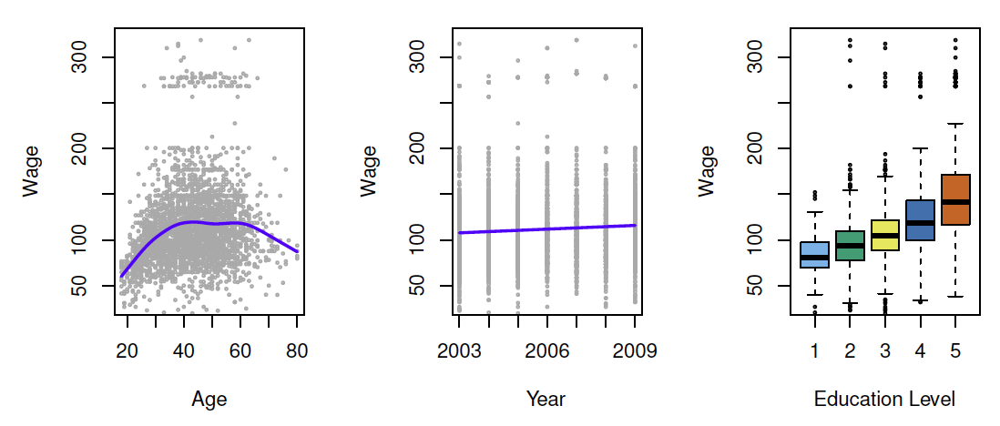
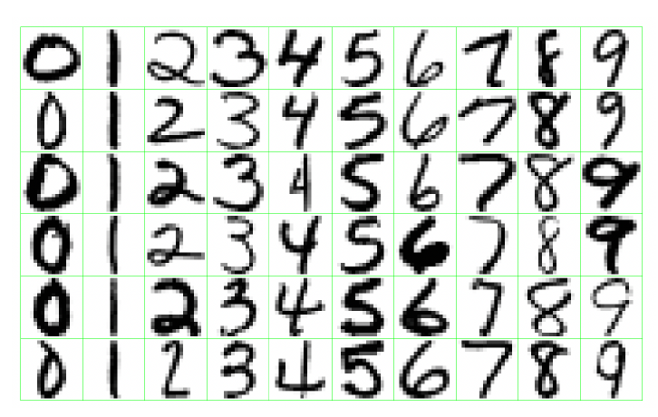
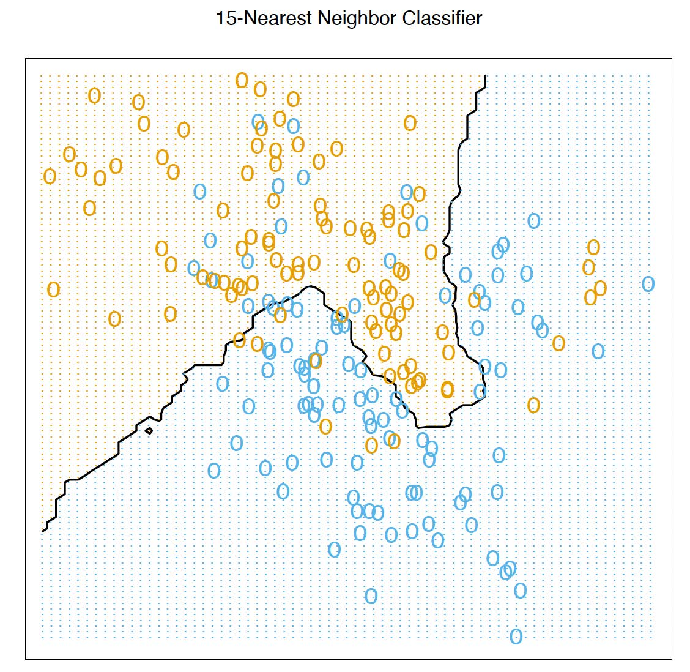
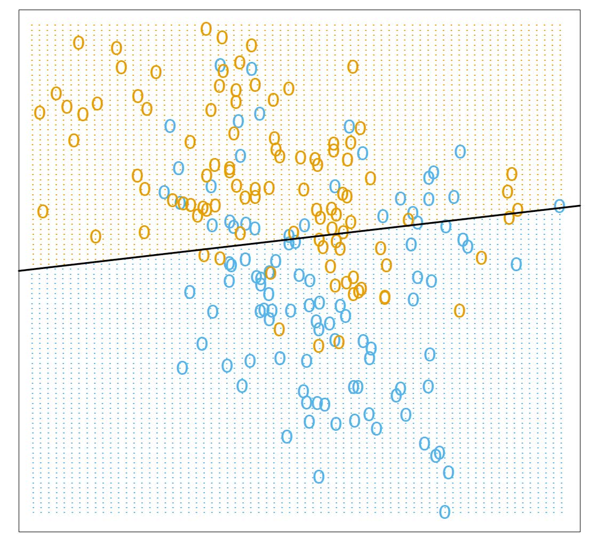
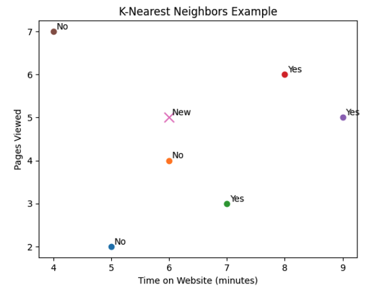
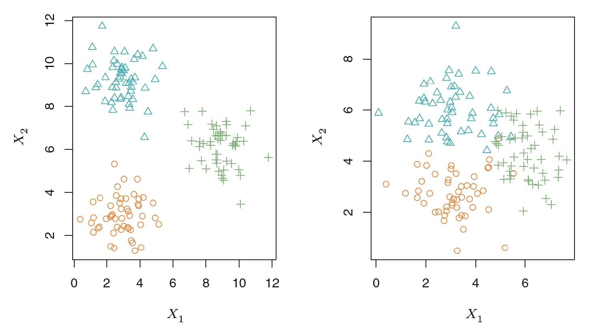

```{r setup, include=FALSE}
#knitr::opts_chunk$set(echo = FALSE)
library(ggplot2)
library(MASS)
```

## Reference

1. Gareth James, Daniela Witten, Trevor Hastie and Robert Tibshirani, 
*An Introduction to Statistical Learning: with Applications in R*.


## Objectives 

Students will

- Understand the difference between supervised learning and unsupervised learning

- Identify supervised learning problems as regression or classification

## An Overview of Statistical  Learning

**Statistical learning** refers to a vast set of tools for *understanding data*.
These tools can be classified as **supervised** or **unsupervised**.


- *Supervised learning* is to build a statistical model for predicting, or estimating, an
*output* based on one or more *inputs*. The output is also known as the **response, target or dependent variable**. The input are also known as *features or independent variables*.


- *Unsupervised learning* uses machine learning techniques to **identify patterns** in data without any prior knowledge about the data. Unsupervised learning methods find insight on data that do not have class labels for a response variable.

### Supervised Learning

**Supervised learning**: building a statistical model for predicting, or estimating, an
output based on one or more inputs.

The purpose of supervised learning is to predict the output value for unlabeled instances. Two common supervised learning processes are **regression** and **classification**.

##### Regression

- **Regression** is the supervised learning process of training a model to predict a **numerical outcome**. 

  - Common regression techniques are: linear models and regression models.
  
  - In the regression problem, $Y$ is quantitative (e.g price, blood pressure).
  

{width=65%}

#### Classification

- **Classification** is the supervised learning process of training a model to predict a **categorical output feature**. Ex: Predicting whether a customer will buy a product, identifying whether an employee is likely to leave, or explaining why an email is spam. 

  - Common classification techniques are: k-nearest neighbors, logistic regression, decision trees, random forests, naive Bayes classification, support vector machines, and neural networks.
  
  - In the classification problem, $Y$ takes values in a finite, unordered set (survived/died,
digit 0-9, cancer class of tissue sample).

{width=65%}

#### Practice: Identifying regression/classification problems.

1) Predict the distance jumped by a long-jumper at the NCAA Track and Field Championships.

2) Explain how to identify a penguin's species based on body measurements.

3) Predict where a high school student will go after graduation.

#### K-Nearest Neighbors

**k-nearest neighbors (kNN)** is a supervised learning algorithm that predicts the output feature of a new instance using other instances that are close for certain input features. 

A value of $k$ is selected and the $k$ instances with the closest input features are found. The output features of those $k$ instances are used to make the prediction.

A **metric** is a method of determining the distance between two instances. The most common metric is the **Euclidean distance**

$$\text{distance}(x,y) = \sqrt{(x_1-y_1)^2+(x_2-y_2)^2 + \cdots + (x_p-y_p)^2}$$

where $x_i$ and $y_i$ are the values for the input features for the instances $x$ and $y$ and $p$ is the number of features.

**K-Nearest Neighbor Example**

{width=45%}

- The predicted class is chosen by majority vote amongst the 15-nearest neighbors.

**A Linear Model and Least Squares Example**

{width=45%}

Linear model can be $$\hat{G} = \begin{cases} \text{Orange} & \hat{y} = x^T\hat{\beta}> 0.5 \\
\text{Blue} & \hat{y} = x^T\hat{\beta}\le  0.5 \end{cases}$$

Two predicted classes are separted by the decision boundary $\{x:x^T\hat{\beta} =0.5 \}$

#### Practice: KNN

{width=45%}

Each point represents a customer with two features:

 - $x_1$: Time on website
 - $x_2$: Pages viewed

The new point is the customer we want to classifiy.

If $k=1$, which class does the customer belong to? What about $k=3$?

### Unsupervised Learning

**Unsupervised learning** uses machine learning techniques to **identify patterns** in data without any prior knowledge about the data. Unsupervised learning methods find insight on data that do not have class labels for a response variable.

- No outcome variable, just a set of predictors (features) measured on a set of samples.

- Objective is more fuzzy — find groups of samples that behave similarly, find features that behave similarly, find linear combinations of features with the most variation.

- Difficult to know how well your are doing.

- Different from supervised learning, but can be useful as a pre-processing step for supervised learning.

#### A Clustering Example with Three Groups

{width=65%}

Left: The three groups are well-separated. In this setting,a clustering approach should successfully identify
the three groups.

Right: There is some overlap among the groups. Now the clustering task is more challenging。

#### Iris K-means clustering
Explore **K-means clustering** interactively using the
[Shiny Gallery](https://shiny.posit.co/r/gallery/).

### Statistical Learning VS Machine Learning

- Machine learning arose as a subfield of Artificial Intelligence.

- Statistical learning arose as a subfield of Statistics.

- There is much overlap — both fields focus on supervised and unsupervised problems:

  - Machine learning has a greater emphasis on **large scale applications and prediction accuracy**.
  - Statistical learning emphasizes models and their **interpretability, and precision and uncertainty**.

 But the distinction has become more and more blurred, and there is a great deal of cross-fertilization.
 


### Training, validation, and test sets

- **Training data** is used to fit a model.

- **Validation data** is used to evaluate model performance while adjusting parameter estimates and conducting feature selection.

- **Test data** is used to evaluate final model performance and compare different models.

When splitting data, how much of the data is put into training, validation, and test sets is a choice. Generally most of the data should be used for training, with the remainder divided between validation and test data. Other considerations such as the model used, the nature of the data used, and how the error is being measured may also influence what ratios are chosen. Usually **60%-90%** of the data is chosen as training data with the remaining data split between validation and test.

In our class, we generally split the data set into training and test data set.

### Some trade-offs 

- Prediction accuracy versus interpretability. 

- Good fit versus over-fit or under-fit.

- Parsimony versus black-box

We often prefer a simpler model involving fewer variables over a black-box predictor involving them all.


