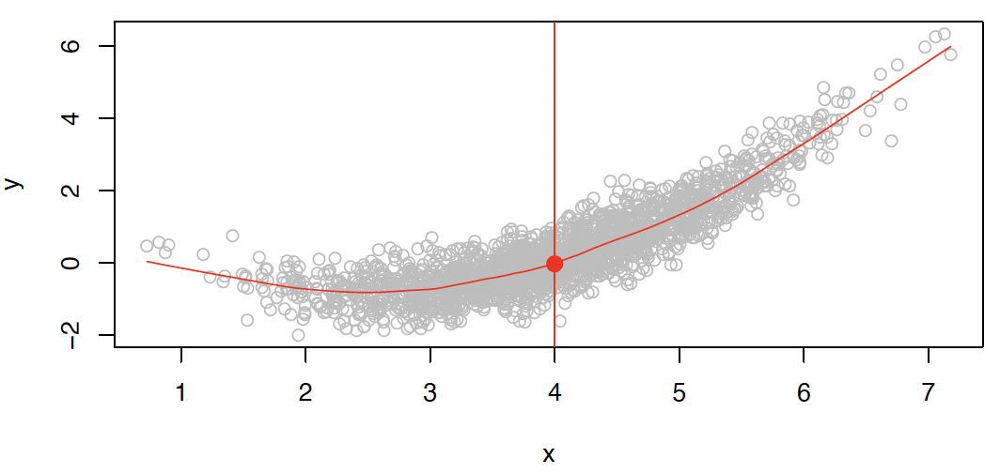
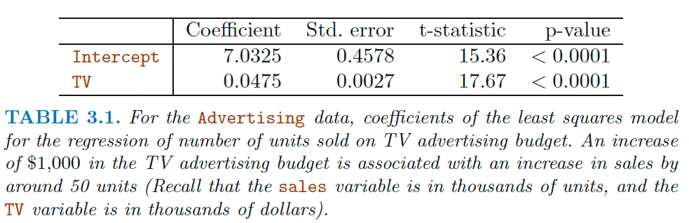
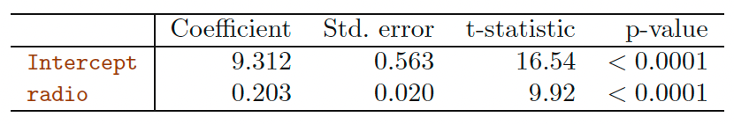
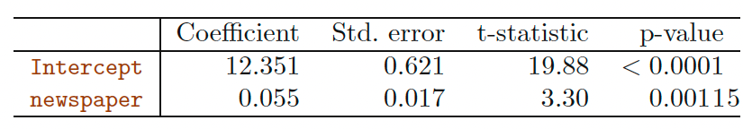
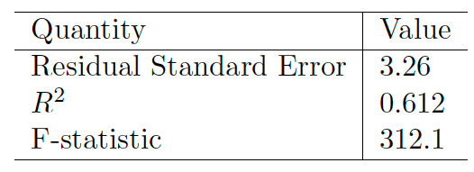

```{r setup, include=FALSE}
knitr::opts_chunk$set(
  echo = TRUE,comment = '', fig.align = 'center'  , out.width="60%"
)
knitr::include_graphics
```

## Reference
1. Chapter 3 of the textbook Gareth James, Daniela Witten, Trevor Hastie and Robert Tibshirani, 
*An Introduction to Statistical Learning: with Applications in R*. 

2. Chapter 11 of the textbook Chantal D. Larose
and Daniel T. Larose
*Data Science Using Python and R*. 

3. Part of this lecture notes are extracted from Prof. Sonja Petrovic ITMD/ITMS 514 lecture notes.


## Objective

- Understand **regression** function and simple linear regression 
- Best approximation, least squares, residual sum of squares (RSS), RSE, $R^2$
- Understand the output of a simple linear regression
- Basic `R` and `Python` command to run a simple linear regression model


## Intro to Regression

### Advertising Example

{width=65%}

Our goal is to develop an accurate **model** ($f$) that can be used to predict `sales` on the basis of the three media budgets: 
$$
  Sales \approx f(TV, Radio, Newspaper).
$$

* `Sales` = a response, target, or output. 
  * The variable we want to predict. 
  * Denoted by $Y$.
* `TV` is one of the features, or inputs. 
  * Denoted by $X_1$.
* Similarly for `Radio` and `Newspaper`. 

*  We can put all the predictors into a single input vector
$$ X = (X_1,X_2,X_3)$$
*  Now we can write our model as
$$ Y=f(X) +\epsilon,$$
where $\epsilon$ captures measurement errors and other discrepancies between the response $Y$ and the model $f$. 

### Regression Function

Formally, the *regression function* is given by $E(Y | X = x)$. This is the
*expected value* of $Y$ at $X = x$.


The *ideal* or *optimal* predictor of $Y$ based on $X$ is thus
$$ f(x) = E(Y | X = x)$$

{width=55%}

## Simple linear regression using a single predictor $X$


* Predict  a  quantitative $Y$ by single predictor  variable $X$
$$ Y \approx \beta_0+\beta_1 X.$$

* Example:  $sales \approx \beta_0+\beta_1\times TV$. 

* $\beta_0$, $\beta_1$ are two unknown constants that represent the **intercept** and **slope**.  [*parameters*, or *coefficients*.] 

**Prediction**
$$ \hat y = \hat\beta_0+\hat\beta_1x.$$


### How to estimate the coefficients

Let $\hat{y}_i = \hat{\beta}_0+\hat{\beta}_1x_i$ be the prediction for $Y$ based on the $i$th value of $X$.

$e_i = y_i-\hat{y}_i$ represents the $i$th **residual**.

**Residual Sum of Squares (RSS)**
$$\text{RSS} = \sum_{i=1}^n e_i^2 = \sum_{i=1}^n(y_i-\hat{y}_i)^2. $$

The **least squares approach** chooses $\beta_0$ and $\beta_1$ to **minimize RSS**. 


{width=65%}


![Fig. 3.2. ISLR: A simulated data set. Left: The red line represents the true relationship, f(X) = 2 + 3X, which is known as the population regression line. The blue line is the least squares line; it is the least squares estimate for f(X) based on the observed data, shown in black. Right: The population regression line is again shown in red, and the least squares line in dark blue. In light blue, ten least squares lines are shown, each computed on the basis of a separate random set of observations. Each least squares line is different, but on average, the least squares lines are quite close to the population regression line.](../figures/3_3.png){width=65%}

### Understand the output

```{r,echo = FALSE}



```

Here $t= \frac{\hat{\beta}_i-0}{SE(\hat{\beta}_i)}$ is a $t$ statistic.

**Question**: Is there a relationship between the response $Y$ and predictor $X$?

We can do a hypothesis testing. 

- check whether $\beta_1=0$

    * Hypothesis test: $H_0:\beta_1=0$ vs $H_1: \beta_1\neq 0$. 
    * a $t$-statistic measures the number of standard deviations that $\beta_1$ is away from 0 
  (specifically, $t= \frac{\hat{\beta}_i-0}{SE(\hat{\beta}_i)}$ with $n-2$ degrees of freedom)
  
- $p$-value 

     * the probability of observing any value equal to t or larger; as usual! - the probability of seeing the data we saw under the $H_0$

     * **in practice, we just read off the $t$-test *or* read off the output of linear models.** 
     

### Assessing model fit 

Question: Suppose we have rejected the null hypothesis in favor of the alternative. Now what??

* Natural: quantify the extent to which the model fits the data. 
* The quality of a linear regression fit is typically assessed using two related quantities:

   - the residual standard error (RSE) and 
   
   - the $R^2$ statistic.

#### Advertising Data Results

```{r,echo = FALSE,out.width="40%"}

```

#### RSE
A measure of the lack of fit of the model simple linear regression model to the data: 
$$ RSE = \sqrt{\frac{1}{n-2}RSS} = \sqrt{\frac{1}{n-2}\sum_{i=1}^n (y_i-\hat{y}_i)^2}$$


* If the predictions obtained using the model are very close to the true outcome values ($\hat{y}_i\approx y_i$  for i = 1, . . . , n), 
then RSE will be small

    - we can conclude that the model fits the data very well.
    
* If $\hat y_i$ is very far from   $y_i$ for one or more observations, then the RSE may be quite large
    
    - indicating that the model doesn’t fit the data well.


**Interpretation: ** 
The RSE provides an absolute *measure of lack of fit*. 
But since it is *measured in the units of $Y$* , it is not always clear what constitutes a good RSE... 

#### $R^2$

The $R^2$ statistic provides an alternative measure of fit (proportion): 

$$ R^2 = \frac{TSS-RSS}{TSS}=1  - \frac{RSS}{TSS}$$ 

  * TSS = total sum of squares $\sum_{i=1}^n(y_i-\bar y)^2$
  where $\bar y = \frac{1}{n}\sum_{i=1}^ny_i$
  * RSS = residual sum of squares $\sum_{i=1}^n(y_i-\hat y_i)^2$ 

$R^2$ measures the proportion of variability in $Y$ that can be explained using $X$


**Interpretation**
 Always between 0 and 1 (independent of scale of $Y$). 

**Question** What's a good value? 

Can be challenging to determine ... in general, depends on the application.


### Example 

Use  simple linear regression on the `Auto` data set.

* Use the `lm()` function to perform a simple linear regression with `mpg` as the response and `horsepower` as the predictor. 

```{r}
require(ISLR)
data(Auto)
fitlm <- lm(mpg ~ horsepower, data=Auto)
```

Where is the output?? 

* Let's take a look at the `fitlm` object. 

Use the `summary()` function to print the results. 
```{r}
summary(fitlm)
```


*  Is there a relationship between the predictor and the response?

   - Yes 

* How strong is the relationship between the predictor and the response?

  - $p$-value is close to 0: relationship is strong 

* Is the relationship between the predictor and the response positive or negative?

  - Coefficient is negative: relationship is negative 

* What is the predicted `mpg` associated with a `horsepower` of $98$? What are the associated 95% confidence and prediction intervals?

First you have to make a new data frame object which will contain the new point: 
```{r}
new <- data.frame(horsepower = 98)
predict(fitlm, new) # predicted mpg
predict(fitlm, new, interval="confidence") # conf interval
predict(fitlm, new, interval="prediction") # pred interval
```

>  What is the difference between confidence and prediction intervals!?   $\rightarrow$ we will learn in the future lecture! 


### Simple plots in R

Plot the response and the predictor. Use the `abline()` function to display the least squares regression line.

```{r} 
plot(Auto$horsepower, Auto$mpg)
abline(fitlm, col="red")
```


Use the `plot()` function to produce diagnostic plots of the least squares regression fit. Comment on any problems you see with the fit.

```{r,out.width="80%"} 
par(mfrow=c(2,2))
plot(fitlm)
```

* residuals vs fitted plot shows that the relationship is non-linear


### In-Class Exercise: Simple Linear Regression

Construct a simple linear regression of `mpg` with `cylinders`, `displacement`, and `acceleration` respectively. Based on the output, answer the following questions:

*  Is there a relationship between the predictor and the response?

* How strong is the relationship between the predictor and the response?

* Is the relationship between the predictor and the response positive or negative?

* Based on the *RSE* and *$R^2$*, which model will you choose for the simple linear regression? Explain it.


