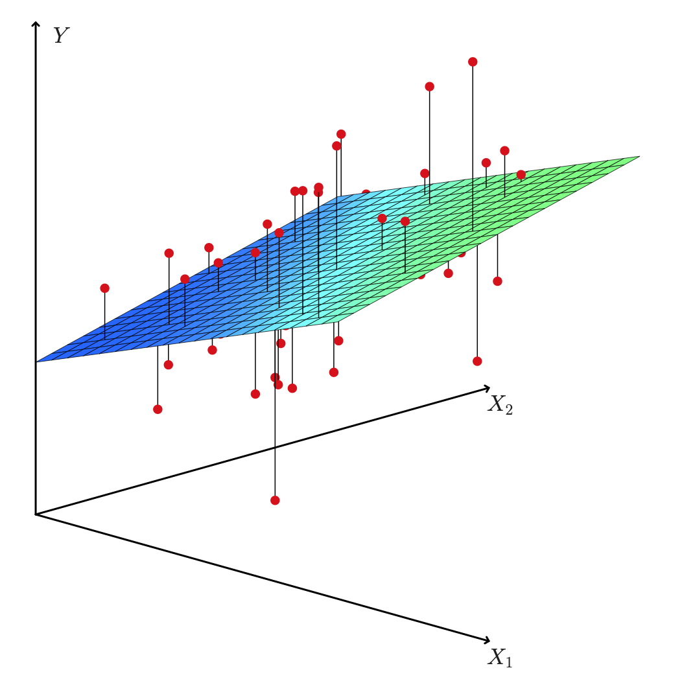
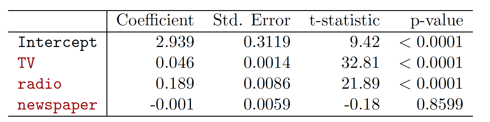
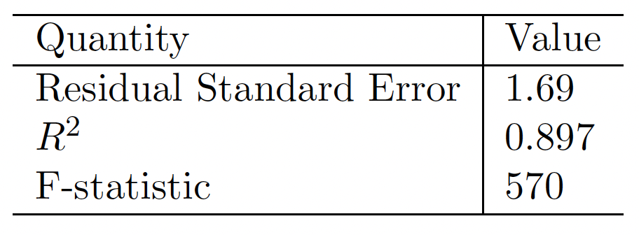
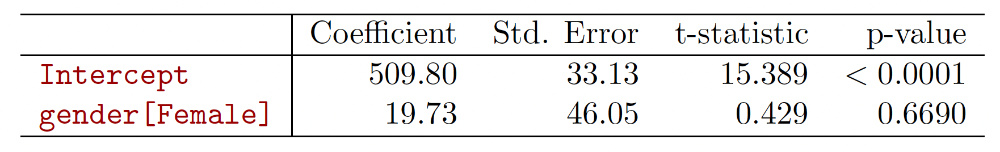
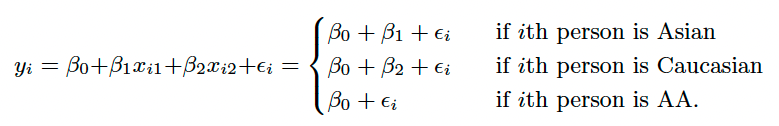

```{r setup, include=FALSE}
knitr::opts_chunk$set(
  echo = TRUE,comment = '', fig.align = 'center'  , out.width="80%"
)
knitr::include_graphics
```


## Reference
1. Chapter 3 of the textbook Gareth James, Daniela Witten, Trevor Hastie and Robert Tibshirani, 
*An Introduction to Statistical Learning: with Applications in R*. 

2. Chapter 11 of the textbook Chantal D. Larose
and Daniel T. Larose
*Data Science Using Python and R*. 

3. Part of this lecture notes are extracted from Prof. Sonja Petrovic ITMD/ITMS 514 lecture notes.


## Objective

- Know how to do multiple linear regression in `R`
- Understand how to do regression with qualitative predictors in `R`


## Multiple Linear Regression


* Predict  a  quantitative $Y$ by more than one  predictor  variable $X_i$
$$ Y \approx \beta_0+\beta_1 X_1+ \beta_2 X_2 + \ldots + \beta_pX_p.$$

* Advertising Example:  
$$sales \approx \beta_0+\beta_1\times TV + \beta_2\times radio + \beta_3 \times newspaper $$


* We interpret $\beta_j$ as the average effect on Y of a one unit
increase in $X_j$ , holding all other predictors fixed.


### How to estimate the coefficients

Let $\hat{y}_i = \hat{\beta}_0+\hat{\beta}_1x_i+ \hat{\beta}_2x_2 + \ldots + \hat{\beta}_px_p$ be the prediction for $Y$ based on the $i$th value of $X$.
$e_i = y_i-\hat{y}_i$ represents the $i$th **residual**.

**Residual Sum of Squares (RSS)**
$$\text{RSS} = \sum_{i=1}^n e_i^2 = \sum_{i=1}^n(y_i-\hat{y}_i)^2 = \sum_{i=1}^n(y_i-(\hat{\beta}_0+\hat{\beta}_1x_i+ \hat{\beta}_2x_2 + \ldots + \hat{\beta}_px_p))^2. $$

The values
$\hat{\beta}_0,\hat{\beta}_1,\ldots,\hat{\beta}_p$ that minimize RSS are the multiple **least squares** regression coefficient estimates.

**Advertising Example**
```{r,echo = FALSE,out.width = "50%"}


```


### Is at least one predictor useful?

**Question**: is there a relationship between the Response and Predictor? 

* Multiple case:  $p$ predictors;  we need to ask whether all of the regression coefficients are zero: $\beta_1=\dots=\beta_p=0$? 

  * Hypothesis test: $H_0:\beta_1=\dots=\beta_p=0$ vs. $H_1:$ at least one $\beta_i\neq 0$. 
  * Which statistic? $$F= \frac{(TSS-RSS)/p}{RSS/(n-p-1)}.$$
      * TSS = total sum of squares $\sum_{i=1}^n(y_i-\bar y)^2$
  where $\bar y = \frac{1}{n}\sum_{i=1}^ny_i$
  * RSS = residual sum of squares $\sum_{i=1}^n(y_i-\hat y_i)^2$ 

* when there is no relationship between the response and predictors, one would expect the F-statistic to take on a value close to 1.   [this can be proved via expected values]
* else $>1$. 

**Revisiting Advertising Example**
```{r,echo = FALSE,out.width = "50%"}

```


### Multiple linear Regression in R 

* Include the package and data; Let's split the data set into two parts `AutoTraining` and `AutoTest`
```{r}
library(ISLR)
data(Auto)
summary(Auto)
i <- sample(2, nrow(Auto), replace=TRUE, prob=c(0.8, 0.2))
AutoTraining <- Auto[i==1,]
AutoTest <- Auto[i==2,]
```

* Produce a scatter plot matrix which includes all of the variables in the data set.
```{r}
pairs(AutoTraining[,1:8],lower.panel = NULL)
```

What are we looking at? (Read the help page on `pairs`.)

* Compute the matrix of *correlations* between the variables using the function `cor()`. You will need to exclude the `name` variable, which is *qualitative*.

```{r}
cor(subset(AutoTraining, select=-name))
```

*  Use the `lm()` function to perform a multiple linear regression with `mpg` as the response and *all* other variables except `name` as the predictors. Why exclude `name`? **There are too many levels in this categorical feature.**

 
```{r}
fitlm <- lm(mpg~., data=AutoTraining[,1:8])
summary(fitlm)
```
Let's refer to the output in this last code chunk: 

* Is there a relationship between the predictors and the response?

   - There is a relationship between predictors and response. 

* Which predictors appear to have a statistically significant relationship to the response?

   - `weight`, `year`, `origin` and `displacement` have statistically significant relationships 

* What does the coefficient for the `year` variable suggest?

   - `r fitlm$coefficients[7]` coefficient for `year` suggests that later model year cars have better (higher) `mpg`. 


* Use the `plot() function to produce diagnostic plots of the linear regression fit. 
```{r}
par(mfrow=c(2,2))
plot(fitlm)
```

* Comment on any problems you see with the fit. Do the residual plots suggest any unusually large outliers? 
  - There is evidence of non-linearity


First you have to make a new data frame object which will contain the new point: 
```{r}
ypred <-predict(object = fitlm, newdata = AutoTest[,1:8])
summary(ypred)
```

To evaluate the mean absolute error (MAE) and mean squared error (MSE), we can install `MLmetric` package.
$$ MAE = \frac{1}{n}\sum_{i=1}^n |y_i-\hat{y}_i|, 
\qquad MSE = \frac{1}{n}\sum_{i=1}^n (y_i-\hat{y}_i)^2.$$

```{r}
library(MLmetrics)
MAE(y_pred = ypred, y_true = AutoTest$mpg)
MSE(y_pred = ypred, y_true = AutoTest$mpg)
```


### In-Calss Exercise: Multiple Linear Regression

* Split the `iris` data set into two parts `IrisTraining` and `IrisTest`

* Construct a multiple linear regression for `Sepal.Length` without using `Species`

* Predict `Sepal.Length` in `IrisTest` and calculate `MAE` and `MSE` 

## Qualitative predictors

Some predictors are not *quantitative* but are *qualitative*, taking a discrete set of values.
These are also called *categorical predictors* or *factor variables*.

Example: investigate differences in credit card balance between males and females, ignoring the other variables. We create a new *dummy variable* 

$$ x_i = \begin{cases} 1 \mbox{, if $i$th person is female} \\ 0\mbox{, if $i$th person is not female} \end{cases}
$$

Resulting model:
$$ y_i=\beta_0+\beta_1x_i +\epsilon = 
\begin{cases} 
\beta_0+\beta_1+\epsilon_i \mbox{, if $i$th person is female} \\ 
\beta_0+\epsilon_i \mbox{, if $i$th person is not female} 
\end{cases}
$$

Interpretation?

  * $\beta_0$ = average $Y$ among non-females 
  * $\beta_0+\beta_1$ = average $Y$ among females
  * $\beta_1$ average difference in $Y$ between the two groups.

Results for gender model:

```{r,echo = FALSE}

```

With more than two levels, we create additional dummy variables. For example, for the ethnicity variable we create two dummy variables. The first could be

$$ x_{i1} = \begin{cases} 1 \mbox{, if $i$th person is Asian} \\ 0\mbox{, if $i$th person is not Asian} \end{cases}
$$


and the second could be

$$ x_{i2} = \begin{cases} 1 \mbox{, if $i$th person is Caucasian} \\ 0\mbox{, if $i$th person is not Caucasian} \end{cases}
$$

Then both of these variables can be used in the regression equation, in order to obtain the model

```{r,echo = FALSE}

```

There will always be one fewer dummy variable than the
number of levels. The level with no dummy variable ---
African American in this example --- is known as the **baseline**.

### Qualitative predictors in R

How to create dummy variable in `R`? We use a date set `Salaries` from package `carData`

```{r}
# Load the data
data("Salaries", package = "carData")
summary(Salaries)
```

### Qualitative predictors with two levels

If we use `sex` as an argument in `lm`, R will correctly treat `sex` as single dummy variable with two categories.

```{r}
md1<-lm(salary~sex,data = Salaries)
summary(md1)
```

### Qualitative predictors with more than two levels

What about the categorical data with more than two levels?

As `rank` is a `factor` with three levels, `R` automatically create two dummy variables.

```{r}
md2<-lm(salary~rank,data = Salaries)
summary(md2)
```
**Question**: What is the baseline here?

### In-Calss Exercise: Qualitative Predictors

* Please construct a simple linear regression model to predict `Sepal.Length` by `Species` in `IrisTraining`.

* Please construct a multiple linear regression model to predict `Sepal.Length` with all features in `IrisTraining`.

* Predict `Seplal.Length` in `IrisTest` and calculate `MAE` and `MSE` 


