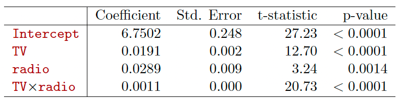
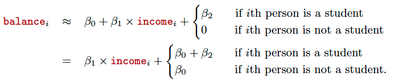
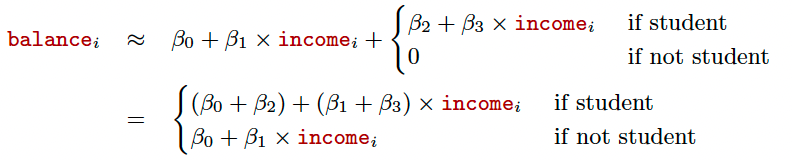
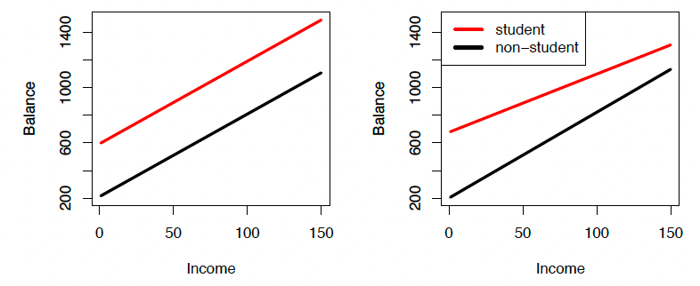

```{r setup, include=FALSE}
knitr::opts_chunk$set(
  echo = TRUE,comment = '', fig.align = 'center'  , out.width="80%"
)
knitr::include_graphics
```


## Reference
1. Chapter 3 of the textbook Gareth James, Daniela Witten, Trevor Hastie and Robert Tibshirani, 
*An Introduction to Statistical Learning: with Applications in R*. 


2. Part of this lecture notes are extracted from Prof. Sonja Petrovic ITMD/ITMS 514 lecture notes.

## Package

```{r}
require(ISLR) #Import ISLR
```


## Objective

- Extension of the Linear Models
- Confidence Interval V.S. Prediction Interval
 


## Extensions of the linear model

> What is wrong with the linear model? It works quite well! 

Yes -- but sometimes the (restrictive) assumptions are violated in practice.

### Assumption 1: additivity

The relationship between the predictors and response is additive. 

* effect of changes in a predictor $X_j$ on the response $Y$ is independent of the values of the other predictors. 

### Assumption 2: linearity

The relationship between the predictors and response is linear. 

* the change in the response $Y$ due to a one-unit change in $X_j$ is constant, regardless of the value of $X_j$. 

### Removing the additive assumption 

Previous analysis of `Advertising` data: 
both `TV` and `radio` seem associated with sales. 

* The linear models that formed the basis for this conclusion: 
$$sales=\beta_0+ \beta_1 TV + \beta_2 radio + \beta_3 newspaper +\epsilon$$

The above model states that the average effect on sales of a one-unit
increase in TV is always $\beta_1,$ regardless of the amount spent
on radio. But suppose that spending money on radio advertising
actually increases the effectiveness of TV advertising, so that the slope term for TV should increase as radio
increases. In this situation, given a fixed budget of $100,000,
spending half on radio and half on TV may increase sales more than allocating the entire amount to either TV or to
radio.

In marketing, this is known as a synergy effect, and in statistics it is referred to as an **interaction effect**.

* We will now explain how to augment this model by allowing interaction between `radio` and `TV` in predicting `sales`: 

\begin{align*}
sales & =\beta_0+\beta_1\times TV+\beta_2\times radio +\beta_3 \times (radio\times TV)+\epsilon\\
& = \beta_0+ (\beta_1+\beta_3\times radio)\times TV + \beta_2\times radio + \epsilon. 
\end{align*}

### Interpretation: 

  * $\beta_3$ =  increase in the effectiveness of TV advertising for a one unit increase in radio advertising (or vice-versa).
  
```{r,echo = FALSE,out.width = "70%"}

```

**Interpretation**

- The results in this table suggests that interactions are
important.
- The p-value for the interaction term TV $\times$ radio is extremely low, indicating that there is strong evidence for
$H_A : \beta_3\ne 0.$
- The $R^2$ for the interaction model is 96.8%, compared to only 89.7% for the model that predicts sales using TV and radio without an interaction term.

### Hierarchy Principle

Sometimes it is the case that an interaction term has a very small p-value, but the associated main effects (in this
case, TV and radio) do not. **If we include an interaction in a model, we should also include the main effects, even if the p-values associated with their coefficients are not significant.**

The rationale for this principle is that interactions are hard
to interpret in a model without main effects--- their meaning is changed. Specifically, the interaction terms also contain main effects,
if the model has no main effect terms.

We can also have the interactions between qualitative and quantitative variables.

Consider the `Credit` data set, and suppose that we wish to predict balance using `income` (quantitative) and `student`
(qualitative).

Without an interaction term, the model takes the form

```{r,echo = FALSE}

```

With interactions, it takes the form

```{r,echo = FALSE}

```

For the Credit data, the least squares lines are shown for prediction
of balance from income for students and non-students. Left: The model
 was fit. There is no interaction between income and student. Right: The
model was fit. There is an interaction term between income and student.

```{r,echo = FALSE}

```

### Interaction in R

Let's revisit the `auto` data set. Here we want to build a model as follows.

$$mpg = \beta_0 + \beta_1 \times horsepower + \beta_2 \times horsepower^2 + \epsilon$$

How to do it in R?

```{r}
horsepowerSquare <- Auto$horsepower * Auto$horsepower
interModel1 <- lm(mpg~ horsepower + horsepowerSquare, Auto)
summary(interModel1)
```
Actually, if it is the interaction with two different features, we just need to use `*`. For example, we want to check the interactions between `horsepower` and `weight`.

```{r}
interModel2 <- lm(mpg~ horsepower * weight, Auto)
summary(interModel2)
```

**Question**: Why I don't need to `+ horsepower + weight`?

We can use the same way to construct interaction regression model with one numeric attribute and one categorical attribute.

**Note**: Only when these two features have interactions, our interactions model can lead to a better performance.

#### In-Calss Exercise: Interaction

* Split `Boston` data set into 80:20 as training and test.
**Please note you need `MASS` package**.

* Please construct an interaction regression model of response `medv` with `crim` and `rm` for the `BostonTraining` data set.

* Predict `medv` in the `BostonTest` and calculate MAE and MSE.

* Please construct an interaction regression model of response `medv` with `lstat` and `rm` for the `BostonTraining` data set.

* Predict `medv` in the `BostonTest` and calculate MAE and MSE.

* Compare these two models.

## Potential problems

### Common issues and problems


1. Non-linearity of the response-predictor relationships. 
2. Correlation of error terms.
3. Non-constant variance of error terms.
4. Outliers.
5. High-leverage points. Reference: https://online.stat.psu.edu/stat462/node/170/
6. Collinearity

(You will learn to deal with these in another course that focuses more on using regression in your application domain.)

## Confidence vs. prediction intervals

**Revisit `Auto` Example**

```{r include=FALSE}
fitLm <- lm(mpg ~ horsepower, data=Auto)
```

* `Auto` data set, regression on `Y=mpg` vs. `X=horsepower`. 

```
fitLm <- lm(mpg ~ horsepower, data=Auto)
```

* What is the predicted `mpg` associated with a `horsepower` of $98$? What are the associated 95% confidence and prediction intervals?

```{r}
new <- data.frame(horsepower = 98)
predict(fitLm, new) # predicted mpg
predict(fitLm, new, interval="confidence") # conf interval
predict(fitLm, new, interval="prediction") # pred interval
```


Three sorts of uncertainty associated with the prediction of $Y$ based on $X_1,\dots,X_p$: 

* $\hat\beta_i\approx\beta_i$: least squares plane is **an estimate** for the true regression plane. 
  * reducible error
* assuming a linear model for $f(X)$ is usually an approximation of reality
  * model bias [potential reducible error?]
  * to operate here, we ignore this discrepancy 
* even if we knew true $\beta_i$, still no perfect knowledge of $Y$ because of random error $\epsilon$
  * irreducible error 
  - how much will $Y$ vary from $\hat Y$? 
  - we use *prediction intervals*. Always wider than confidence intervals.
  
**`Advertising` confidence**

**Confidence interval** Quantify the uncertainty surrounding the average sales over a large number of cities.

For example:

* given that
$100,000 is spent on TV advertising and 
* $20,000 is spent on radio advertising
in each city, 
* the 95 % confidence interval is [10,985, 11,528]. 
* We interpret
this to mean that 95 % of intervals of this form will contain the true value of $f(X)$. 

**`Advertising` prediction**

**Prediction interval** Can be used to quantify the uncertainty surrounding sales for a particular city.

* Given that $100,000 is spent on TV advertising and 
* $20,000 is spent on radio advertising in that city 
* the 95 % prediction interval is [7,930, 14,580].
* We interpret this to mean that 95 % of intervals of this form will contain the true value of Y for this city.

> Note that both intervals are centered at 11,256, but that the prediction interval is substantially wider than the confidence interval, reflecting the increased uncertainty about sales for a given city in comparison to the average sales over many locations.


