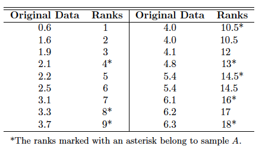
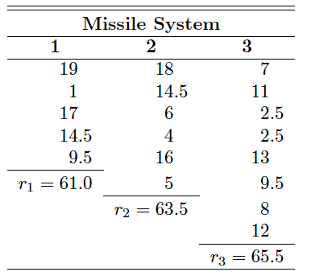

```{r setup, include=FALSE}
knitr::opts_chunk$set(echo = TRUE,comment = '', fig.align = 'center'  , out.width="50%")
```

## Reference

1. Probability & Statistics for Engineers & Scientist, 9th Edition, Ronald E. Walpole, Raymond H. Myers, Sharon L. Myers, Keying Ye, Prentice Hall


## Outline

* Sign Test
* Wilcoxon Rank-Sum Test
* Kruskal-Wallis Test


## NonParametric Tests

Most of the hypothesis-testing procedures are based
on the assumption that the random samples are selected from **normal populations**.
Fortunately, most of these tests are still reliable when we experience slight departures
from normality, particularly when the sample size is large. Traditionally,
these testing procedures have been referred to as **parametric methods**.

Here we consider a number of alternative test procedures, called **nonparametric**
or **distribution-free** methods, that often assume no knowledge whatsoever
about the distributions of the underlying populations, *except perhaps that they are continuous*.


Nonparametric, or distribution-free procedures, are used with increasing frequency
by data analysts. There are many applications in science and engineering
where the data are reported as values not on a continuum but rather on an ordinal
scale such that it is quite natural to assign ranks to the data.


### Sign Tests

The **sign test** is used to test hypotheses on a population **median**, denoted as $\tilde{\mu}$.

In the case of many of the nonparametric procedures, the mean is replaced by the median as
the pertinent **location parameter** under test.

Given a random variable $X$, $\tilde{\mu}$ is defined such that

$$P(X >\tilde{\mu}) \le 0.5, \qquad \text{and} \qquad P(X< \tilde{\mu}) \le 0.5.$$ 

In the continuous case, $$P(X > \tilde{\mu}) = P(X< \tilde{\mu})=0.5.$$ 

In testing the null hypothesis $H_0$ that $\tilde{\mu} = \tilde{\mu}_0$  against an appropriate
alternative, on the basis of a random sample of size $n$, we replace each sample
value *exceeding $\tilde{\mu}_0$ with a plus sign and each sample value less than $\tilde{\mu}_0$ with a minus sign*. 

The appropriate test statistic for the sign test is the **binomial random variable**
$X$, representing the number of plus signs in our random sample. If the null hypothesis $\tilde{\mu} = \tilde{\mu}_0$ 
that  is true, the probability that a sample value results in either
a plus or a minus sign is equal to $1/2$. Therefore, to test the null hypothesis that $\tilde{\mu} = \tilde{\mu}_0$ , we actually test the null hypothesis that the number of plus signs is a value
of a random variable having the binomial distribution with the parameter $p = 1/2$.


**Example 1**. The following data represent the number of hours that a rechargeable hedge trimmer operates before a recharge is required: 1.5, 2.2, 0.9, 1.3, 2.0, 1.6, 1.8, 1.5, 2.0, 1.2, 1.7. Use the sign test to test the hypothesis, at the 0.05 level of significance, that this particular trimmer operates a median of 1.8 hours before requiring a recharge.

**Hypotheses**：
$$ H_0: \tilde{\mu} = 1.8, \qquad H_1: \tilde{\mu} \ne 1.8.$$

**Confidence Level**: $\alpha = 0.05$

**Test Statistic**: Binomial variable $X$ with $p =\frac{1}{2}$

**Computations**: $+$ denotes the value exceeds 1.8 and $-$ for the value less than 1.8 and disregarding the value is $1.8$. Thus we have the following sequences.
$$ - \qquad + \qquad - \qquad - \qquad + \qquad - \qquad - \qquad + \qquad - \qquad -$$
Here $n = 10, x = 3$ and $n/2 = 5$. To calculate the p value

```{r}
X <- 3
n <- 10
p <- 1/2
2* pbinom(X,n,p)
```


#### One-Sample SignTest in R

We need `DescTools` package.

```{r}
library(DescTools) #import needed package
x<-c(1.5, 2.2, 0.9, 1.3, 2.0, 1.6, 1.8, 1.5, 2.0, 1.2, 1.7)
mutilde0 <- 1.8
alpha <- 0.05
SignTest(x, alternative = "two.sided", mu = mutilde0, conf.level = 1-alpha)
```

**Example 2** A taxi company is trying to decide whether the use of radial tires instead of regular
belted tires improves fuel economy. Sixteen cars are equipped with radial tires and
driven over a prescribed test course. Without changing drivers, the same cars are
then equipped with the regular belted tires and driven once again over the test
course. The gasoline consumption, in kilometers per liter, is given in below.
Can we conclude at the 0.05 level of significance that cars equipped with radial
tires obtain better fuel economy than those equipped with regular belted tires?

```{r}
RadialTires<-c(4.2,4.7,6.6,7.0,6.7,4.5, 5.7, 6.0,7.4,4.9,6.1,5.2,5.7,6.9,6.8,4.9)
BeltedTires<-c(4.1,4.9,6.2,6.9,6.8,4.4,5.7,5.8, 6.9, 4.9,6.0,4.9,5.3,6.5,7.1,4.8)
```


**Hypotheses**：
$$ H_0: \tilde{\mu}_1 - \tilde{\mu}_2 =0, \qquad H_1: \tilde{\mu}_1 - \tilde{\mu}_2 >0.$$

**Confidence Level**: $\alpha = 0.05$

**Test Statistic**: Binomial variable $X$ with $p =\frac{1}{2}$

**Computations**: $+$ denotes the positive difference
 and $-$ for the negative difference vand disregarding two zero differences. Thus we have the following sequences.
$$ + \qquad - \qquad + \qquad + \qquad - \qquad + \qquad + \qquad + \qquad + \qquad + \qquad + \qquad +
\qquad - \qquad +$$

Here $n = 14, x = 11$ and $n/2 = 7$. To calculate the p value

```{r}
X <- 11
n <- 14
p <- 1/2
1- pbinom(X-1,n,p)
```

#### Two-Sample SignTest in R

```{r}
alpha <- 0.05
SignTest(RadialTires,BeltedTires, alternative = "greater", mu = 0, conf.level = 1-alpha)
```

#### In-Class Practice: Sign Test

A paint supplier claims that a new additive will
reduce the drying time of its acrylic paint. To test this
claim, 12 panels of wood were painted, one-half of each
panel with paint containing the regular additive and
the other half with paint containing the new additive.
The drying times, in hours, were recorded as follows:

```{r}
NewAdditive<-c(6.4,5.8,7.4,5.5,6.3,7.8,8.6,8.2,7.0,4.9,5.9,6.5)
RegularAdditive<-c(6.6,5.8,7.8,5.7,6.0,8.4,8.8,8.4,7.3,5.8,5.8,6.5)
```

Using $\alpha = 0.05$.

- What are the hypotheses?
- How many positive differences? negative differences? zero differences?
- Use `pbinom` to calculate the p value. What's your decision.
- Use `Sign Test` to perform a sign test. What's your conclusion?


### Wilcoxon Rank-Sum Tests

When we are interested in testing equality of means of two continuous distributions
that are obviously **nonnormal**, and samples are independent (i.e., there is *no pairing*0
of observations), the **Wilcoxon rank-sum test** or **Wilcoxon two-sample test**
is an appropriate alternative to the *two-sample t-test*.

We shall test the null hypothesis $H_0$ that $\tilde{\mu}_1 = \tilde{μ}_2$ against some suitable alternative.

- Select a random sample from each of the populations. Let $n_1$ be
the number of observations in the smaller sample, and $n_2$ the number of observations in the larger sample. When the samples are of equal size, $n_1$ and $n_2$ may be randomly assigned. 

- Arrange the $n_1 + n_2$ observations of the combined samples in
**ascending order** and substitute a rank of $1, 2,\cdots, n_1 + n_2$ for each observation. In the case of ties (identical observations), we replace the observations by the mean of the ranks that the observations would have if they were distinguishable. Similar to the Sign Test.

- The sum of the ranks corresponding to the $n_1$ observations in the smaller sample is denoted by $w_1$. Similarly, the value $w_2$ represents the sum of the $n_2$ ranks corresponding to the larger sample. We can easily know
$$w_1 + w_2 = \frac{(n_1+n_2)(n_1+n_2+1)}{2} \Longrightarrow w_2 =\frac{(n_1+n_2)(n_1+n_2+1)}{2} -w_1. $$

- In actual practice, we usually base our decision on the value
$$u_1 = w_1-\frac{n_1(n_1+1)}{2} \qquad u_2 = w_2-\frac{n_2(n_2+1)}{2}\qquad u = \min(u_1,u_2).$$

We have

$$ H_0: \tilde{\mu}_1 = \tilde{\mu}_2, \qquad H_1:\begin{cases}
\tilde{\mu}_1 < \tilde{\mu}_2 & \text{ Compute } u_1\\
\tilde{\mu}_1 > \tilde{\mu}_2 & \text{ Compute } u_2\\
\tilde{\mu}_1 \ne \tilde{\mu}_2 & \text{ Compute } u
\end{cases} $$

**Example 3** The nicotine content of  two brands of cigarettes, measured in milligrams, was found
to be as follows:

```{r}
BrandA<-c(2.1,4.0,6.3,5.4,4.8,3.7,6.1,3.3)
BrandB<-c(4.1,0.6,3.1,2.5,4.0,6.2,1.6,2.2,1.9,5.4)
```

Test the hypothesis, at the 0.05 level of significance, that the median nicotine contents of the two brands are equal against the alternative that they are unequal.

**Hypotheses**：
$$ H_0: \tilde{\mu}_1-\tilde{\mu}_2 = 0, \qquad H_1: \tilde{\mu}_1-\tilde{\mu}_2 \ne 0.$$

**Confidence Level**: $\alpha = 0.05$

**Critical Region**: $u \le 17$

**Ranks**:

```{r,echo = FALSE}

```

Thus, 
$$n_1 = 8, n_2 = 10, w_1 = 93, w_2 = \frac{18(19)}{2}-93= 78, u_1 = 93-\frac{(8)(9)}{2} =57, u_2 = 78-\frac{(10)(11)}{2} = 23. $$

We should not reject the null hypothesis, as $u> 17$.

We can also use `wilcox.test` in R to calculate.


```{r}
wilcox.test(BrandA,BrandB, alternative = "two.sided")
wilcox.test(BrandA,BrandB, alternative = "two.sided",exact = FALSE)
```

As p value is greater than $\alpha=0.05$, we should not reject the null hypothesis.

**Note**: The Wilcoxon rank-sum test is always
**superior** to the t-test for decidedly *nonnormal* populations.

#### In-Class Exercise: Wilcos Rank-Sum Test

The following data represent the number of
hours that two different types of scientific pocket calculators
operate before a recharge is required.

```{r}
A<-c(5.5,5.6,6.3,4.6,5.3,5.0,6.2,5.8,5.1)
B<-c(3.8,4.8,4.3,4.2,4.0,4.9,4.5,5.2,4.5)
```

Use the rank-sum test with $\alpha = 0.01$ to determine if
calculator A operates longer than calculator B on a full
battery charge.

**Hint: Critical value is 14**

- What are the hypotheses?
- Please Calculate $w_1,w_2,u_1,u_2$. What is your conclusion?
- Use `wilcox.test` to perform a Wilcox Rank Sum test. What's your conclusion?


### Kruskal-Wallis Test

The technique of analysis of variance was prominent
as an analytical technique for testing equality of $k \ge 2$ population means. Again,
however,that **normality** must be assumed in order for the
F-test to be theoretically correct. In this section, we investigate a nonparametric *alternative to analysis of variance*.

The **Kruskal-Wallis test**, also called the **Kruskal-Wallis H test**, is a generalization
of the rank-sum test to the case of $k > 2$ samples. It is used to test
the null hypothesis $H_0$ that $k$ independent samples are from identical populations.

Let $n_i (i = 1, 2, \cdots , k)$ be the number of observations in the $i$th sample. 

- Combine all k samples and arrange the $n = n_1 + n_2 + \cdots + n_k$ observations in ascending order

- Substitute the appropriate rank from $1, 2, \ldots, n$ for each observation. In the case of ties (identical observations), we follow the usual procedure of replacing the observations by the mean of the ranks that the observations would have if they were distinguishable. 

- The sum of the ranks corresponding to the $n_i$
observations in the $i$th sample is denoted by the random variable $R_i$.

- Calculate a test statistic
$$H = \frac{12}{n(n+1)} \sum_{i=1}^{k} \frac{R_i^2}{n_i} -3(n+1),$$
which is approximated very well by a Chi-squared distributions with $k-1$ degrees of freedom when $H_0$ is true, provided each sample consists of *at least 5 observations*. The critical regions is $H > \chi_{\alpha}^2$ with $v=k-1$ degrees of freedom.

**Example 4** In an experiment to determine which of three different missile systems is preferable, the propellant burning rate is measured. The data, after coding, are given below. 

```{r,echo = FALSE}
missleSystem <-data.frame(
  burningRate =c(24.0,16.7,22.8,19.8,18.9,23.2,19.8,18.1,17.6,20.2,17.8,
                18.4,19.1,17.3,17.3,19.7,18.9,18.8,19.3),
  type=c(1,1,1,1,1,2,2,2,2,2,2,3,3,3,3,3,3,3,3)
)
print(missleSystem)
```


Use the Kruskal-Wallis test and a significance level of α = 0.05 to test the
hypothesis that the propellant burning rates are the same for the three missile systems.


**Hypotheses**：
$$ H_0: \tilde{\mu}_1=\tilde{\mu}_2 = \tilde{\mu}_3, \qquad H_1: \text{The three means are not all equal}.$$

**Confidence Level**: $\alpha = 0.05$

**Critical Region**: $v = k-1 = 2$

```{r}
alpha <- 0.05
v<- 2
qchisq(1-alpha,v)
```

Therefore, critical region is $h>\chi^2_{0.05} = 5.991$, for $v=2$.

**Ranks**:

```{r,echo = FALSE}

```

**Test Statistics**: 

As $n_1 = 5, n_2 = 6,n_3 =8$, we have
$$ h = \frac{12}{(19)(20)}\left(\frac{61.0^2}{5} + \frac{63.5^2}{6} + \frac{65.5^2}{8}\right) - (3)(20) = 1.66 < \chi^2_{0.05}.$$

Therefore, we should not reject the null hypothesis.


We can also use `kruskal_test` in R to calculate.

```{r}
kruskal.test(burningRate~type,data = missleSystem)
```

We got the same result.

#### In-Class Exercise: Kruskal-Wallis Test

The following data represent the operating
times in hours for three types of scientific pocket calculators
before a recharge is required:

```{r,echo = FALSE}
calculators<-data.frame(
  operatingHours =c(4.9,6.1,4.3,4.6,5.2,5.5,5.4,6.2,5.8,5.5,5.2,4.8,
                    6.4,6.8,5.6,6.5,6.3,6.6),
  type=c("A","A","A","A","A","B","B","B","B","B","B","B","C","C","C","C","C","C")
)
print(calculators)
```

Use the Kruskal-Wallis Test, at the 0.01 level of significance,
to test the hypothesis that the operating times
for all three calculators are equal.

**Hint: Critical value is 9.2103**

- What are the hypotheses?
- Please Calculate $R_i$ and $H$ and find the critical region. What is your conclusion?
- Use `kruskal.test` to perform a Kruskal-Wallis test. What's your conclusion?


